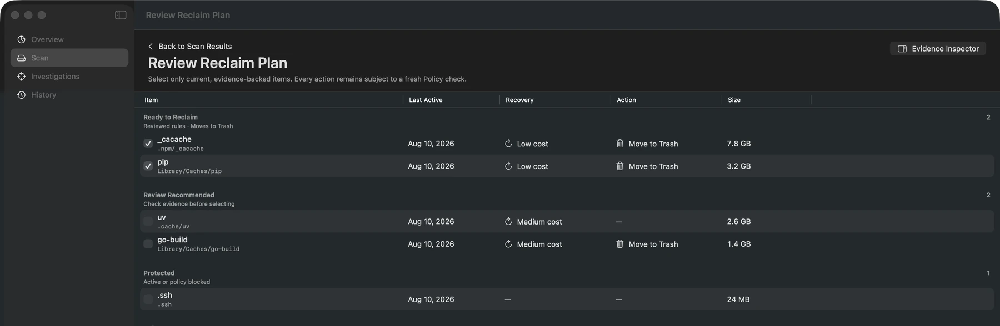

# Stornaut

> Map the known. Investigate the unknown. Reclaim with evidence.

<p align="center">
  
</p>

Stornaut 是我为自己的 macOS 开发机做的原生磁盘清理工具。它用 Swift 扫描磁盘、
识别开发缓存与项目产物，并把大小、活动状态、恢复成本和权限缺口整理成可勾选的
清理建议。

`Stornaut` 读作 `STORE-naut`，由 `storage + -naut` 构成，意为“存储空间
探索者”。

<p align="center">
  
</p>

<p align="center"><sub>实际 macOS App · Dark appearance · 内置演示数据，不读取宿主磁盘</sub></p>

## 它解决什么问题

开发环境会持续积累通用清理器难以判断的内容：

- 多个项目中的 `node_modules`、`.venv`、DerivedData 和构建产物；
- npm、pnpm、Bun、uv、Go、Cargo、Homebrew 等工具缓存；
- IDE、模拟器、容器、虚拟机与 AI 工具运行时；
- 位于非标准路径、无法仅靠固定规则解释的大目录；
- APFS、swap、稀疏文件和权限限制造成的空间统计差额。

Stornaut 不只列目录大小，还记录“它是什么、为什么占空间、是否仍在使用、删除后
如何恢复，以及当前证据是否足够”。无法确认的内容保持 `Unknown`，不会被包装成
一个看似确定的清理建议。

## 核心流程

```text
Swift Surveyor
  → Knowledge Base / Activity Protection
  → Evidence Store / Space Ledger
  → Review
  → User Approval
  → Policy Gate / Trash-only Executor
```

- **Quick Scan**：确定性扫描已知路径，统计实际分配空间并记录不可访问范围。
- **Space Ledger**：区分已解释、未知、不可测量与系统可用空间，不把权限失败写成
  `0 B`。
- **Review**：用 `Ready to Reclaim`、`Review Recommended`、`Protected` 和
  `Unknown` 表达不同处置建议。
- **History**：保存扫描快照与清理清单，便于回看和比较。
- **Codex Investigation**：代码库包含只读调查、证据归一化和受控运行时边界；
  普通 App 组合不会把模型变成任意 Shell 删除器。

## 安全边界

- 扫描与调查不直接修改目标文件。
- Codex 可以提供调查结论，但没有清理执行权。
- 清理计划必须重新验证路径、文件身份、活动状态和保护规则。
- 普通文件只允许移入废纸篓；失败时不会回退为永久删除。
- 系统目录、凭据、活动项目和证据不足的目标保持受保护或未知。
- 不包含遥测、后台监控、定时扫描或登录启动项。

## 构建与运行

要求：

- Apple Silicon Mac
- macOS 26
- Xcode 26 / Swift 6.3

```bash
git clone git@github.com:eriklee1895/stornaut.git
cd stornaut
open Stornaut.xcodeproj
```

在 Xcode 中选择 `Stornaut` scheme 和 `Debug` 配置后运行。

仓库提供固定版本的本地开发工具：

```bash
scripts/bootstrap-dev-tools
scripts/doctor-dev-tools
```

执行无图形会话依赖的验证：

```bash
scripts/verify --headless
```

完整本机 UI、性能和产物验证需要图形会话及对应 macOS 权限：

```bash
scripts/verify --full
```

## 代码结构

| 路径 | 内容 |
| --- | --- |
| `StornautApp/` | SwiftUI macOS App、Overview、Scan、Review、History 与 Settings |
| `Sources/StornautCore/` | 扫描、规则、证据存储、空间核算、Policy 与清理领域模型 |
| `Sources/StornautCodex/` | Codex 发现、协议、只读运行时与能力诊断 |
| `Sources/StornautInvestigation/` | Investigation 规划、协调和报告投影 |
| `Sources/StornautExecution/` | Trash 与受控执行 authority |
| `Rules/` | 内置规则与执行 profile 源文件 |
| `Tests/`、`StornautAppTests/` | SwiftPM、App contract 与回归测试 |
| `scripts/` | 构建、验证、诊断与开发工具入口 |

## 文档

- [文档地图](docs/README.md)
- [产品需求](docs/product/PRD.md)
- [系统架构](docs/architecture/system-architecture.md)
- [Agent 磁盘治理设计](docs/design/agent-disk-governance.md)
- [UI/UX 设计](docs/design/ui-ux.md)
- [本地开发工具](docs/agent/development-tooling.md)

## License

[MIT](LICENSE)
