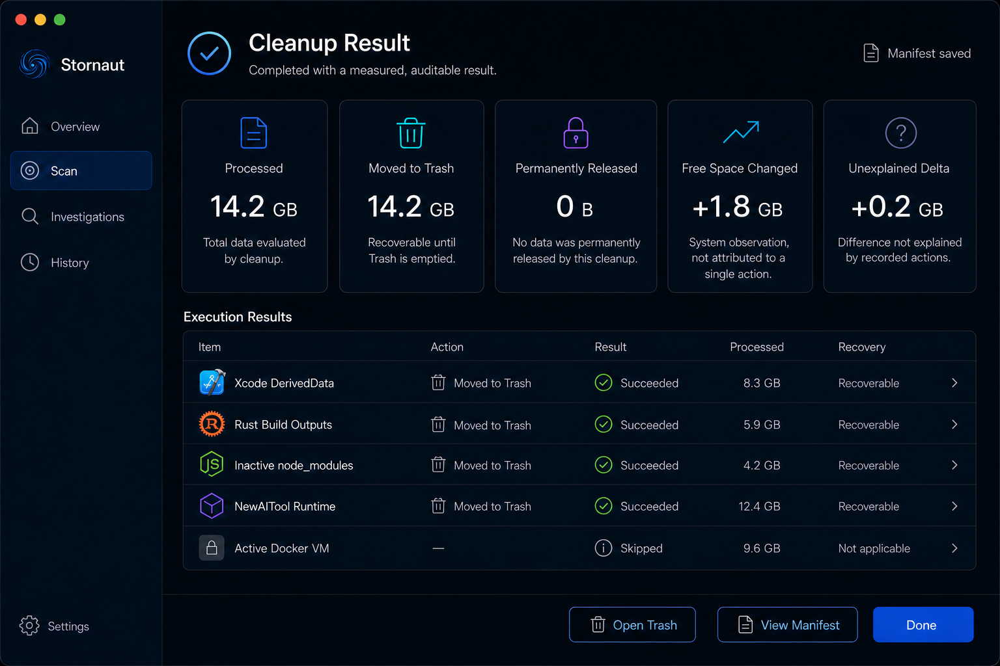
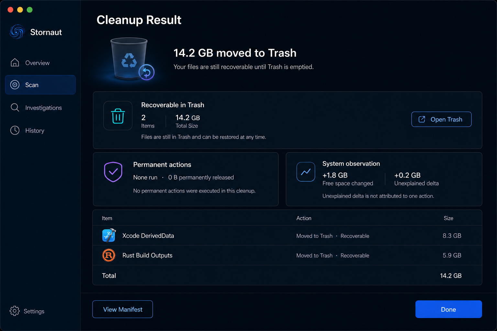
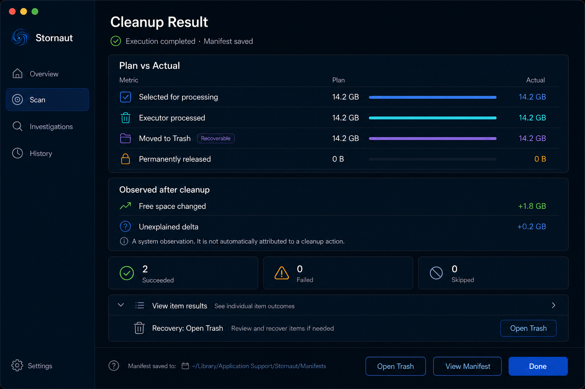
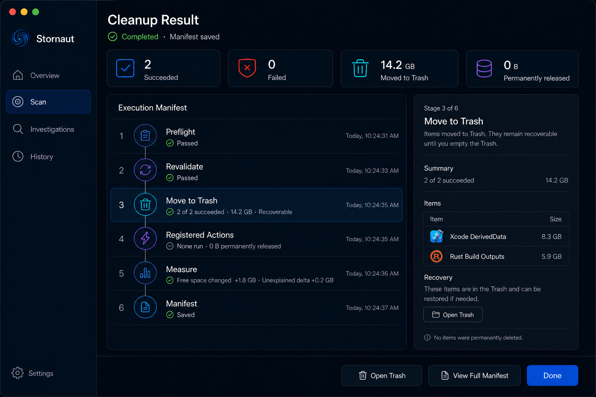
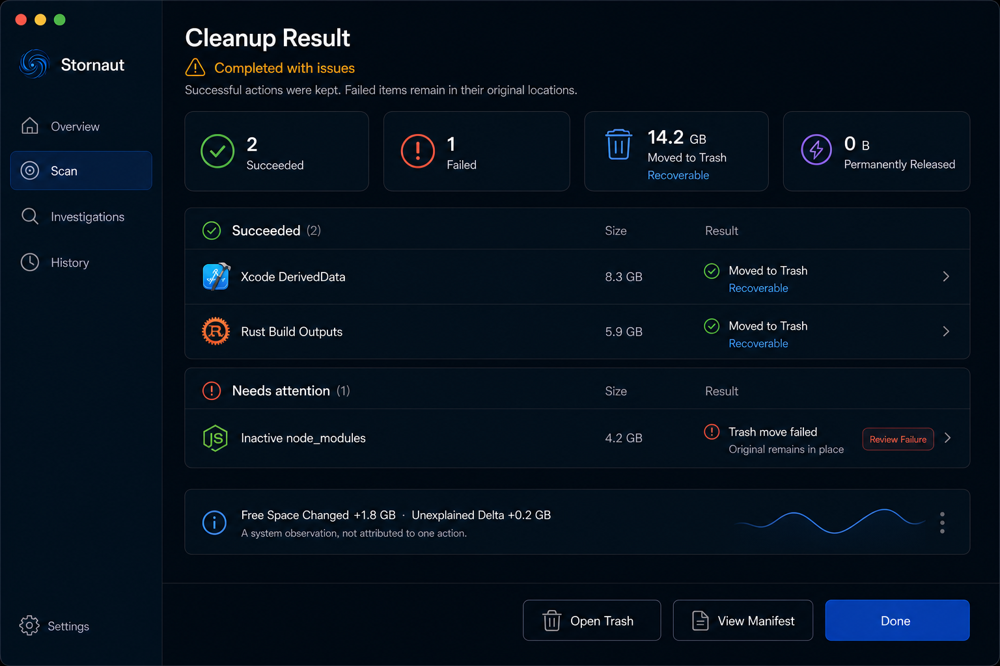
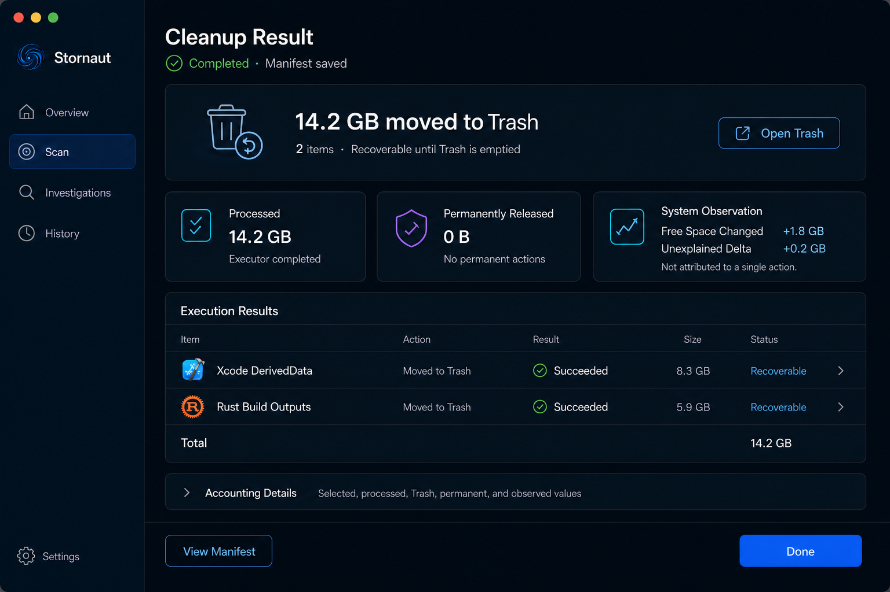
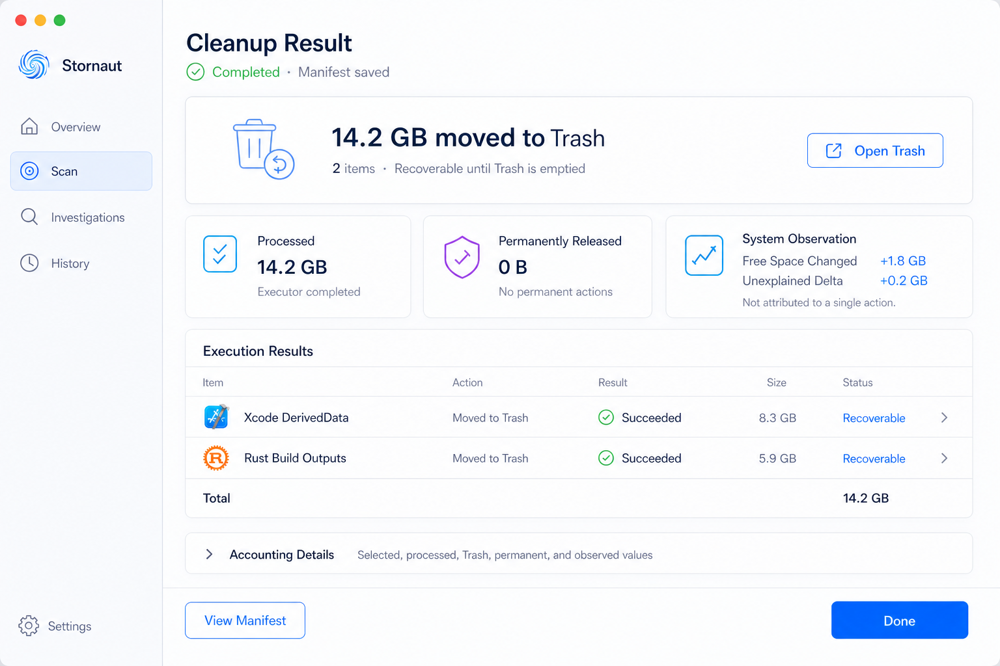

# Stornaut Cleanup Result — Internal Draw

> Generated: 2026-08-08  
> Tool: built-in `imagegen`  
> Status: internally reviewed; B default + A accounting + E partial-state direction approved without a user tie-break

## Fixed product grammar

- Cleanup Result is a workflow page under `Scan`, not a top-level sidebar destination.
- `Moved to Trash` means recoverable storage content; it is not the same as permanent release or observed free-space growth.
- The page keeps candidate/selected bytes, executor-processed bytes, Trash bytes, permanent-action bytes, free-space delta, and unexplained delta distinct.
- Free-space delta is a timestamped system observation and is not automatically attributed to any single cleanup action.
- Partial failure preserves successful actions and reports failed items as remaining in their original locations. Trash failure never falls back to permanent deletion.
- Every displayed aggregate and row outcome comes from one persisted Cleanup Manifest; the View must not independently add example rows or derive competing totals.
- Completion uses a restrained state transition, not confetti, gamification, or a large misleading `Freed`/`Reclaimed` claim.

## Candidate draw

### A — Accounting Ledger

Strongest numeric separation and easiest audit at a glance. Five equally dominant cards make the page feel like an accounting console, and the generated sample rows expose why all aggregates must come from the same Manifest rather than from presentation-layer arithmetic.

### B — Reversible First

Best default mental model: what happened, whether it is recoverable, and where to restore it. It keeps permanent actions and system observations separate without making the first read overly technical. Approved as the dominant composition.

### C — Plan versus Actual

Excellent explanation of selected, processed, Trash, and permanent values. Too much reconciliation detail for the default result page; retain it as the expanded `Accounting Details` disclosure.

### D — Manifest Timeline

Strongest audit and troubleshooting view. Its six-stage timeline and Inspector are appropriate for `View Manifest`, not for the completion landing state.

### E — Partial Outcome

Approved partial/error-state reference. Successful actions remain visible and recoverable; failed rows state that originals remain in place and lead to read-only failure details. The page does not retry blindly or offer permanent deletion.

## Approved default composition

Use B as the dominant hierarchy, A as the accounting contract, and E as the adaptive partial-state grammar.

1. Keep the existing sidebar with `Scan` selected.
2. Header shows `Cleanup Result`, terminal outcome, and Manifest persistence state.
3. The hero reports the primary action literally: `N GB moved to Trash`, item count, and recoverability. `Open Trash` appears once inside this hero.
4. Separate compact cards show `Processed`, `Permanently Released`, and `System Observation`; no card or visual adds these numbers together.
5. The result table shows item, action, result, size, and recovery status. Its total and all summary cards are projections of the same Manifest.
6. `Accounting Details` is collapsed by default and expands into C's plan/actual ledger.
7. Bottom actions are `View Manifest` and one filled `Done`; no duplicate `Open Trash` button.

### Canonical references

The theme pair fixes hierarchy, action placement, accounting separation, and recovery language. Item names, paths, icons, timestamps, and numbers remain illustrative fixtures, not product constants.

## Partial and failed outcomes

- `Completed`: all requested actions reached a terminal successful or intentional skipped state.
- `Completed with issues`: at least one action succeeded and at least one failed; successful outcomes remain in the Manifest and are not rolled back implicitly.
- `Failed`: no requested write completed. The page states whether each original remains in place and provides `View Failure Details`; it still writes a Manifest if persistence is available.
- A failed Trash row says `Original remains in place`. It never offers `Delete Permanently` as recovery.
- Retry is shown only after revalidation proves the action is still eligible; otherwise the user returns to Review.
- Status uses icon, text, and accessible semantic color. Partial status is neutral amber; red is reserved for the actual failed row or unrecoverable Manifest persistence failure.

## Motion and accessibility

- Completion transition is a single 200–300 ms state change using opacity/scale; Reduce Motion replaces it with an immediate state update.
- VoiceOver announces terminal status first, followed by succeeded/failed counts and the literal Trash/permanent distinction.
- Tab order follows header → recovery hero → accounting cards → result rows → disclosure → footer actions.
- Number labels use tabular figures and localized byte formatting.

## Implementation boundary

Generated artwork is not a pixel specification. In particular, the canonical sample values are coherent fixtures for hierarchy review, while production values must be formatted from a single immutable Manifest snapshot. The UI must never infer permanent release from Trash bytes or infer action causality from free-space delta.
