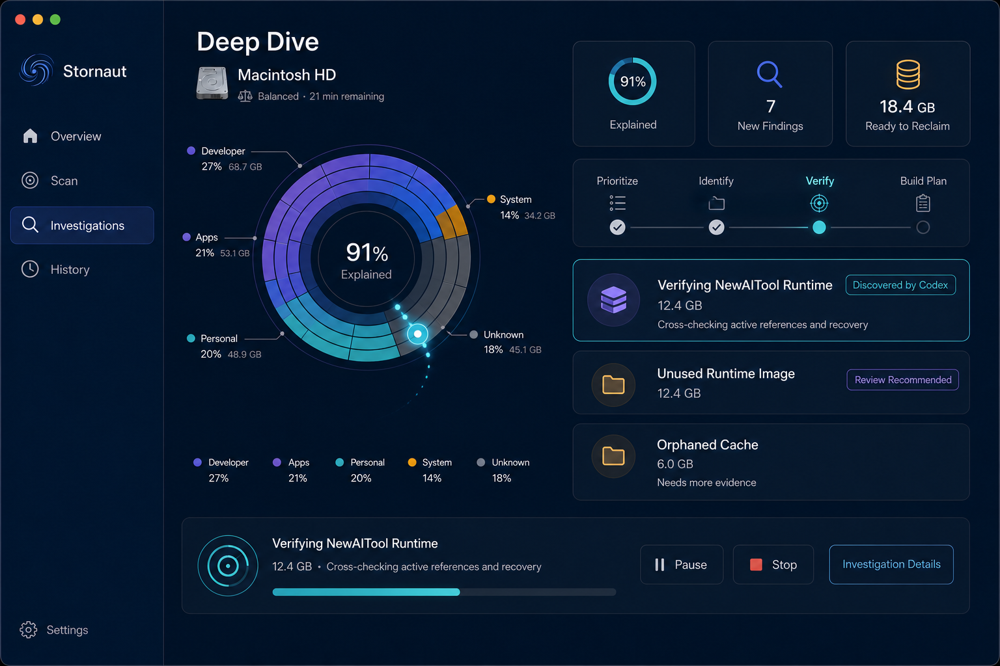
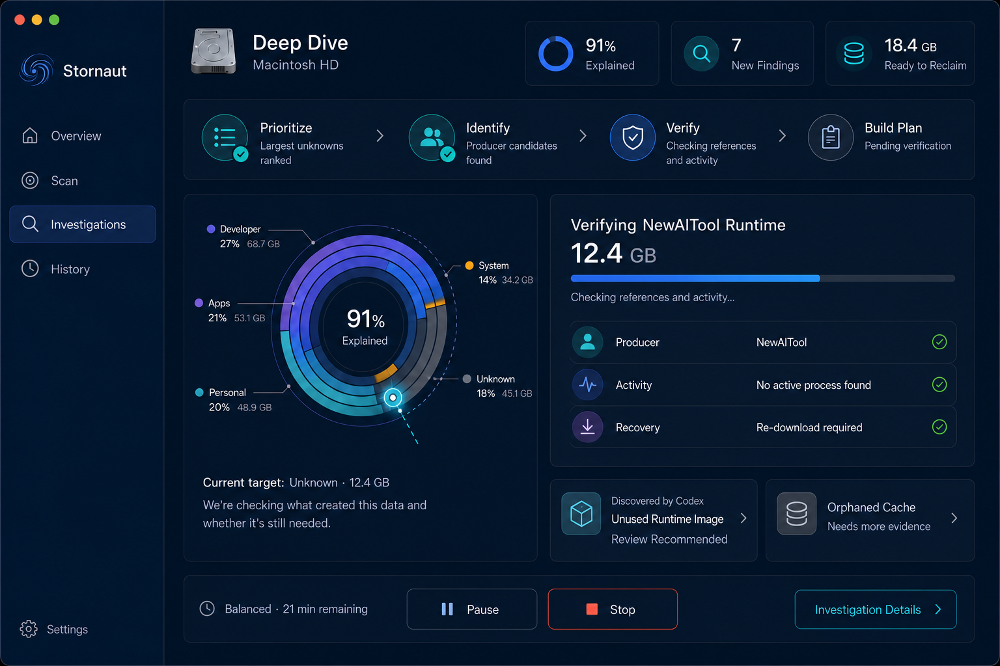
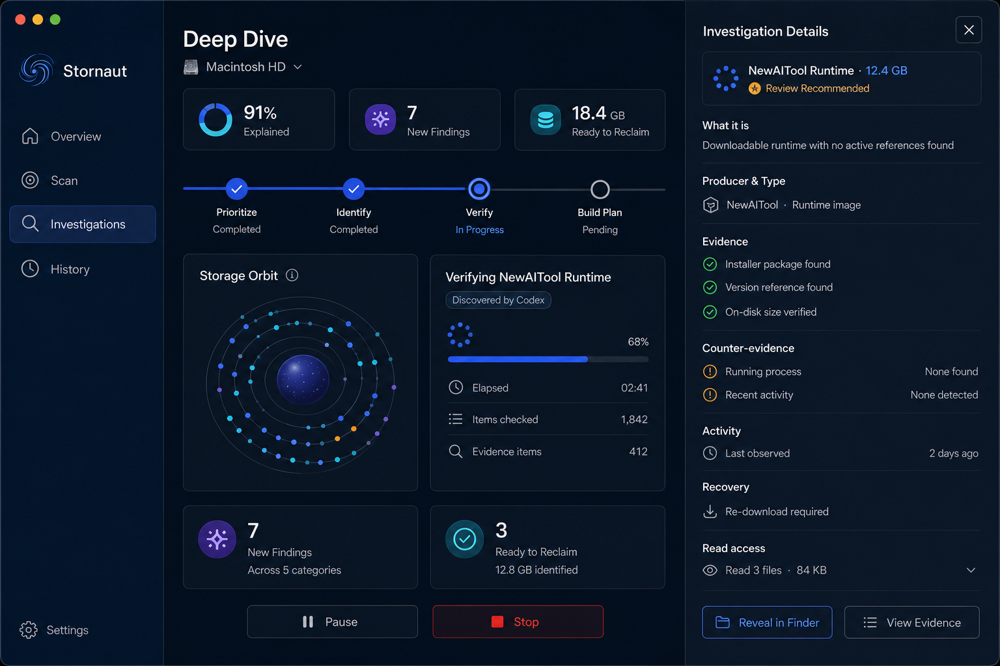

# Stornaut Deep Dive — Round 2 Draw

> Generated: 2026-08-08  
> Tool: built-in `imagegen`  
> Status: selection complete — B default + C Inspector approved; borrow A's Probe trajectory

## Approved decision

The user approved the recommendation on 2026-08-08:

- B `Guided Journey` is the default Deep Dive composition.
- C `Evidence Inspector` is the on-demand state opened by `Investigation Details`, not a default permanent panel.
- A contributes its clearer Probe trajectory and current-target emphasis.
- The circular visualization is a functional layered storage chart, not a constellation or star map. Do not use star fields, constellation lines, scattered stars, or astronomical decoration.

## Fixed visual and product grammar

- Inherits the approved canonical Overview sidebar, surfaces, type, palette, and 8pt spacing rhythm.
- Sidebar is exactly `Overview`, `Scan`, `Investigations`, `History`; Settings remains separate.
- The scientific flow is `Prioritize` → `Identify` → `Verify` → `Build Plan`.
- Default Deep Dive exposes progress, current target, evidence-backed findings, remaining budget, Pause, Stop, and optional `Investigation Details`.
- No chat, terminal, raw log stream, chain-of-thought, cleanup action, or Agent avatar.
- Nautilus Probe marks only the active target. `Discovered by Codex` marks only a newly identified, evidence-backed item.
- Inspector shows observed facts, counter-evidence, recovery, typed probes, and bytes read; it never shows model reasoning or raw sensitive content.

## A — Probe Focus

The active storage orbit is the primary instrument. Metrics, stages, and findings sit in a right rail; a bottom progress surface owns Pause, Stop, and Investigation Details.

Strengths: strongest live-investigation identity, best Probe expression, rich status at a glance.  
Risk: the orbit and right rail compete slightly; less approachable than B.

Prompt direction: use canonical Overview as the binding system, retain a medium-large directly labeled orbit, place the Probe on the current unknown sector, and keep findings plus controls concise without chat or logs.

## B — Guided Journey

The four scientific stages become the main narrative. A medium orbit explains where the Agent is looking, while the current-focus panel explains what is being checked and why in plain language.

Strengths: easiest for occasional users, clearest long-running-process model, calmest balance of visual and evidence.  
Risk: slightly less dramatic than A.

Prompt direction: prioritize the four-stage journey, pair a medium functional orbit with one large current-focus/evidence card, and keep detailed audit information behind Investigation Details.

## C — Evidence Inspector

This is not a competing default screen. It tests B/A with the native right-side Inspector open. The Inspector shows What it is, Producer & Type, Evidence, Counter-evidence, Activity, Recovery, and Read access.

Strengths: strongest transparency and auditability; supports expert verification without polluting the default view.  
Risk: narrower main canvas and higher density while open.

Prompt direction: preserve a simple main investigation and add an approximately 32% native split-view Inspector containing only observed facts and audited probe results.

## Approved composition

Use B as the default Deep Dive composition and C as its on-demand Inspector state. Borrow A's stronger Probe trajectory and current-target emphasis. This gives beginners a comprehensible investigation journey while preserving expert auditability.

## Known image-generation drift

- Candidate C uses sparkle-like glyphs for one metric/current item. Replace these with the approved magnifier/probe/evidence icon language; sparkles are not normative.
- Exact example values, icon artwork, line wrapping, and spacing are illustrative. SwiftUI implementation must use real domain data, localization, semantic tokens, and accessibility summaries.
- `Stop` ends the investigation and produces a partial report; it does not delete or clean anything.
