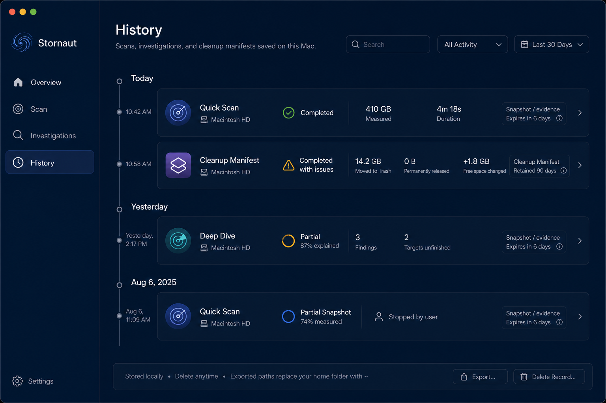
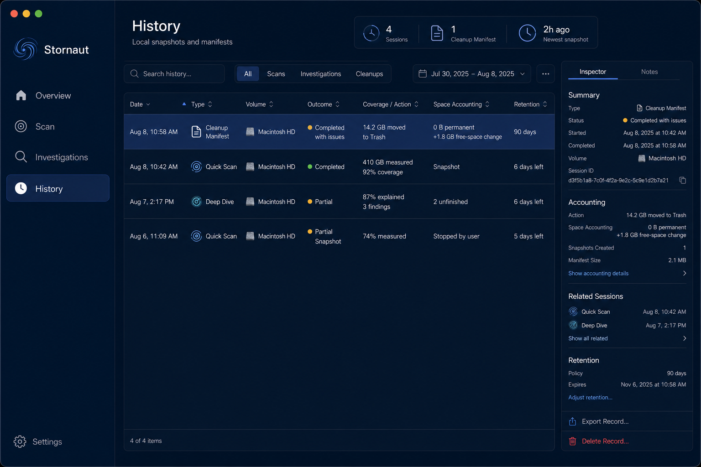
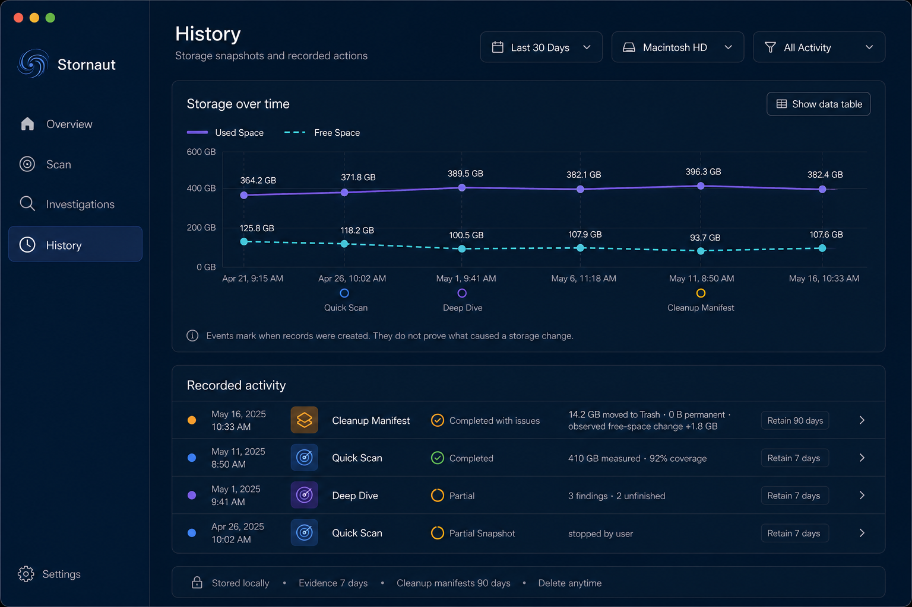
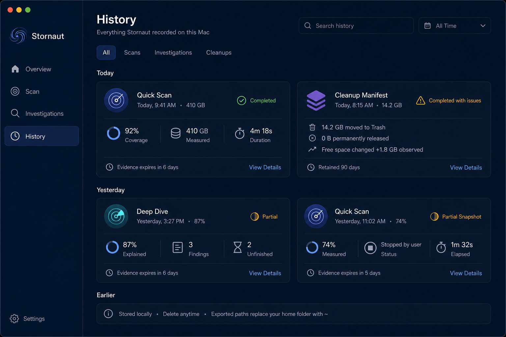
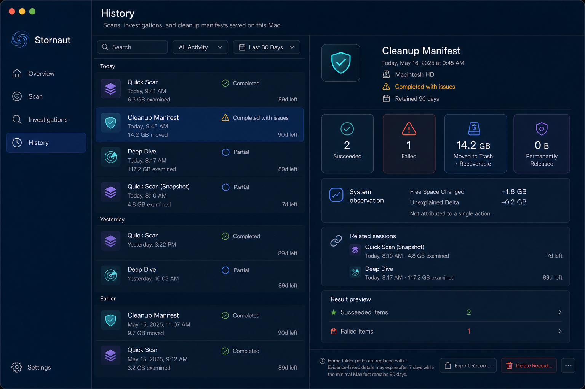
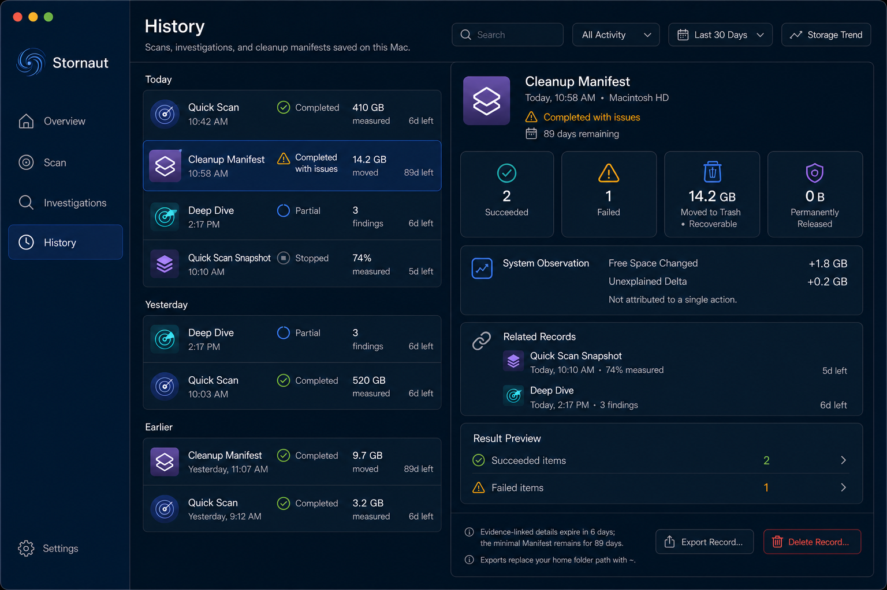
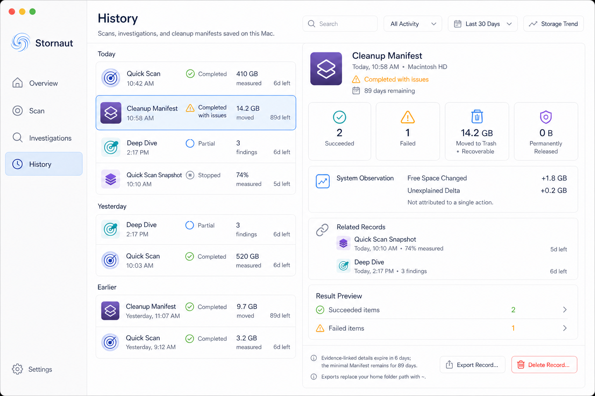

# Stornaut History — Internal Draw

> Generated: 2026-08-08  
> Tool: built-in `imagegen`  
> Status: internally reviewed; E master-detail + A grouping + C optional trend approved without a user tie-break

## Fixed product grammar

- History is a top-level workspace containing Quick Scan sessions, Deep Dive sessions, snapshots/reports, and Cleanup Manifests.
- Records are local-only. The page never implies background monitoring, cloud sync, or continuous collection.
- Scan/investigation sessions, evidence, reports, and related records default to a 7-day lifetime. Minimal Cleanup Manifests remain for 90 days without evidence payloads or content-derived summaries.
- Users may delete records immediately. Deleting a record does not restore, remove, or otherwise change files on disk or in Trash.
- Exports replace the user's home-folder prefix with `~`; export copy must not imply that this alone anonymizes every remaining path segment.
- A storage trend is built from timestamped snapshots. Activity markers show when records were created and never establish causality for a storage change.
- Expired linked evidence appears as `Evidence expired`, not as a broken record or fabricated empty result.

## Candidate draw

### A — Unified Timeline

Best chronological comprehension and clearest retention language. Wide event cards become repetitive with a long history, so its date grouping is adopted without retaining the full-width timeline as the default layout.

### B — Audit Ledger

Fastest sorting and comparison for experts. A permanently open table plus Inspector is too dense for the default workspace. The generated `Adjust retention` action is rejected because v1 approves fixed defaults and immediate deletion, not arbitrary retention extension.

### C — Change Story

Strongest explanation of storage change over time. It correctly separates event markers from causality and includes a table fallback. Adopt it as the optional `Storage Trend` state rather than consuming most of the default History screen.

### D — Session Cards

Approachable and visually generous, but low-density cards require excessive scrolling and make cross-session comparison harder. Rejected as the desktop default.

### E — Master–Detail

Best native macOS fit. The session navigator preserves chronological context while the detail pane supports accounting, related records, retention, export, and deletion without route churn. Approved as the dominant structure, subject to corrected TTL and restrained failure styling.

## Approved default composition

Use E as the dominant native master-detail workspace, A's date grouping in the session navigator, and C as an optional trend state.

1. The app sidebar keeps `History` selected.
2. Header contains search, type filter, date range, and a secondary `Storage Trend` action. History has no filled primary CTA.
3. A 350–400 pt session navigator groups records by `Today`, `Yesterday`, and `Earlier`. Rows show type, timestamp, terminal status, one key metric, and retention countdown.
4. Selection defaults to the newest record; keyboard navigation changes detail selection without changing any file state.
5. The detail pane renders a type-specific projection of the selected immutable record. A Cleanup Manifest keeps succeeded, failed, Trash, permanent release, and system observation values separate.
6. `Related Records` expresses evidence lineage only. It never states or visually implies that one event caused a later free-space change.
7. `Export Record…` and `Delete Record…` live in the detail footer. Delete is destructive and confirmed; no `Adjust Retention` control exists in v1.

### Canonical references

The pair fixes the three-column relationship, density, retention semantics, detail hierarchy, and action placement. Dates, sizes, counts, icons, and selected records remain illustrative fixtures.

## Storage Trend state

- `Storage Trend` replaces the detail pane or opens a dedicated History substate; it is not a modal and not permanently shown above the session list.
- Use a line chart only with at least four comparable snapshots. With fewer points, show dated metric rows instead.
- Used and Free series differ by label and line style as well as color.
- Quick Scan, Deep Dive, and Cleanup Manifest markers sit on the time axis with the persistent caption: `Events mark when records were created. They do not prove what caused a storage change.`
- Every chart has keyboard-reachable points, exact timestamp/value tooltips, a VoiceOver summary, and `Show Data Table`.
- No forecast, anomaly alert, smoothing that changes values, or background/live animation appears in v1.

## Retention and degraded states

- Normal 7-day records display an exact expiry date in detail and a compact countdown in the navigator.
- Cleanup Manifests display their independent 90-day expiry. Linked evidence may expire earlier while the minimal Manifest remains readable.
- After evidence expiry, affected sections show `Evidence expired` and the expiry timestamp; Manifest action/result/accounting/error metadata remains available until its own expiry.
- If a record expires while selected, selection moves to the next available record after an accessible announcement. The UI does not silently reuse stale detail.
- Empty History shows `No history yet` and a single `Start Quick Scan` action; it does not suggest background collection.
- Loading preserves navigator/detail geometry. A corrupt record is isolated to one row with `Couldn’t read this record`; other history remains usable.

## Export and delete

- Export uses the native save panel and exports the selected record only unless the user explicitly invokes a future bulk action.
- The exporter rewrites the canonical home prefix to `~` and warns that project/subdirectory names can still be identifying.
- Cleanup Manifest export contains only its retained minimal audit fields after linked evidence expires.
- Delete confirmation names the selected record, states that deletion cannot be undone, and explicitly says it does not alter files, Trash, or prior cleanup effects.
- On successful deletion, focus moves predictably to the next record and VoiceOver announces the result.

## Implementation boundary

Generated images are composition references, not literal storage fixtures. Production retention labels must derive from persisted expiry timestamps, not from hard-coded `6d` or `89d` strings. Detail views consume one immutable record projection and must not query or mutate the file system directly.
