# Stornaut Onboarding and Permissions — Internal Draw

> Generated: 2026-08-08  
> Tool: `$erik-gpt-image-2` / OpenAI `gpt-image-2`
> Status: internally reviewed; A structure + C transparency approved without a user tie-break

## Fixed product grammar

- First launch is a dedicated setup flow of at most three steps; it does not use the main app sidebar.
- Quick Scan is local and does not invoke Codex.
- Full Disk Access is optional. Limited mode remains useful and reports restricted locations as `Unmeasurable` rather than `0 B` or failure.
- Stornaut asks once during setup, provides a Settings repair path, and does not repeatedly prompt during normal scans.
- Connecting Codex is optional. Missing or skipped Codex affects Deep Dive only.
- Installing/finding Codex and verifying the Deep Dive safety boundary are separate states. Until the controlled bridge passes the technical Spike and runtime check, Deep Dive stays paused.
- Setup never cleans files, and permission never enables automatic cleanup.

## Candidate draw

### A — Guided Focus

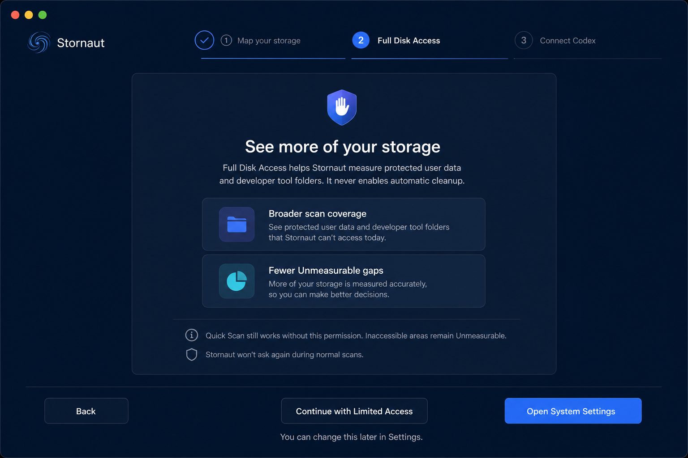

Strongest default flow. One decision per page, a persistent three-step rail, respectful limited-access escape hatch, and enough safety context without becoming a policy document.

### B — Setup Checklist

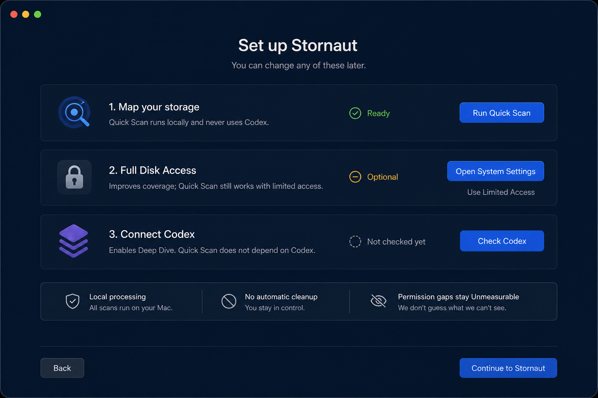

Good at-a-glance status, but too many competing row actions and duplicate continuation paths for first launch. Retain the pattern for a future Settings `Setup Status` section, not onboarding.

### C — Coverage Comparison

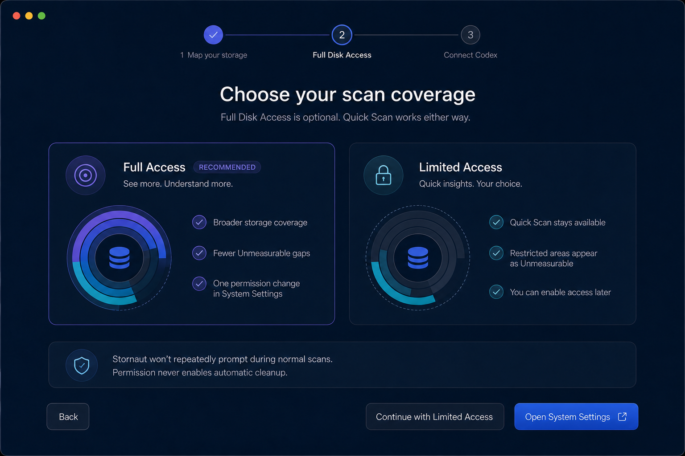

Best explanation of Full versus Limited behavior. The symmetric large cards resemble a plan comparison and over-weight an optional permission. Retain its transparent consequence comparison in a compact strip inside A.

### D — Contextual Preview

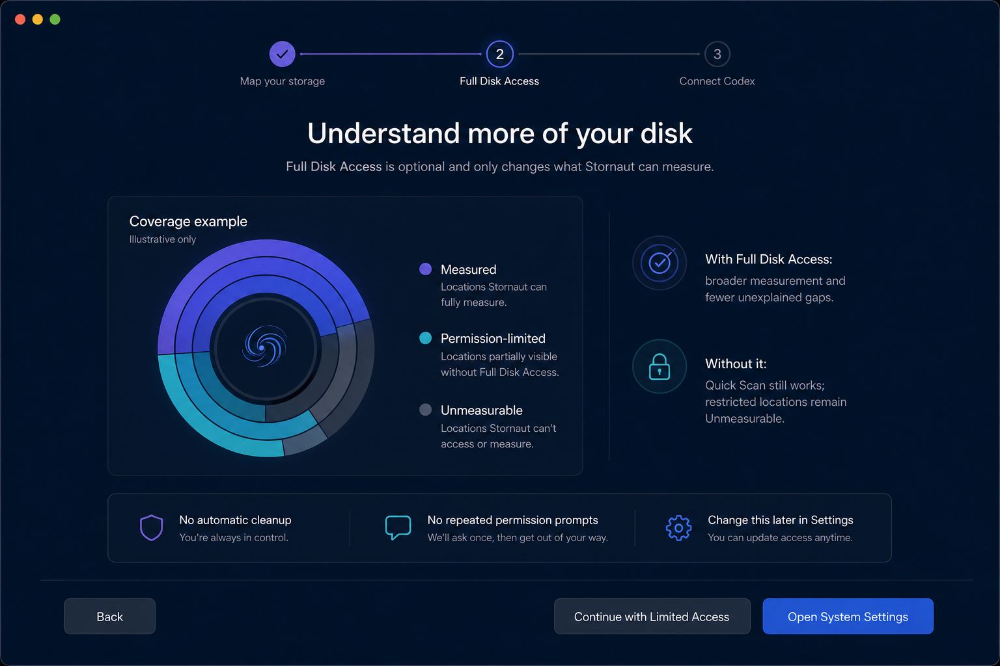

The coverage example teaches `Measured`, `Permission-limited`, and `Unmeasurable` well, but an illustrative disk chart can be mistaken for a real scan. Reserve this diagram for help or permission details, clearly labeled illustrative.

### E — Native Sheet

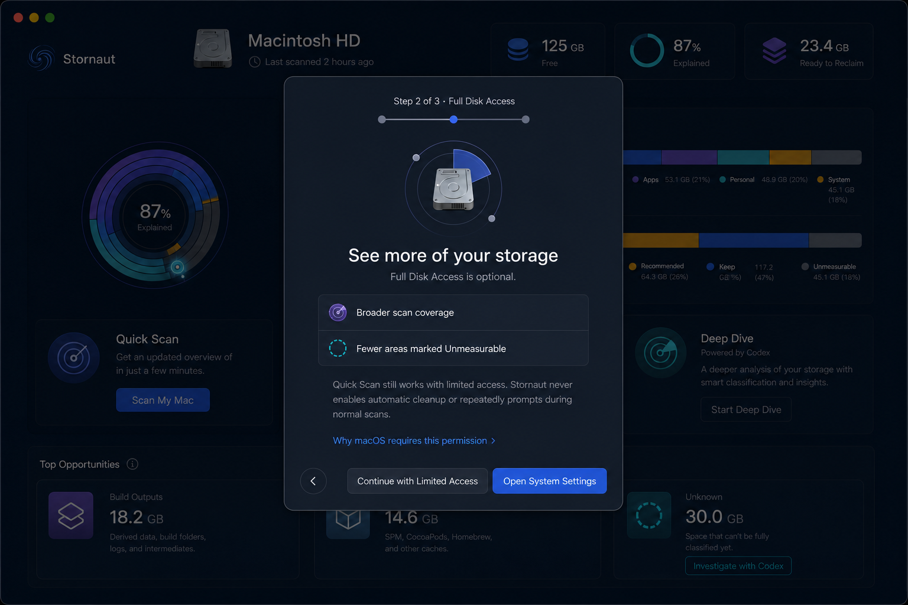

Compact and familiar, but appearing over an already-populated dashboard falsely implies that a scan exists before setup and weakens continuity between the three steps. Rejected as first-launch structure.

## Approved composition

Use A's dedicated three-step structure, with C's Full/Limited consequences compressed into step 2. All steps are skippable and each optional capability has a visible degraded path.

### Step 1 — Map your storage

- Establish three promises: local-first Quick Scan, evidence before action, and reversible-by-default cleanup.
- State explicitly that Codex is not used for Quick Scan and nothing is cleaned during setup.
- Actions: `Skip Setup` and one primary `Continue`.

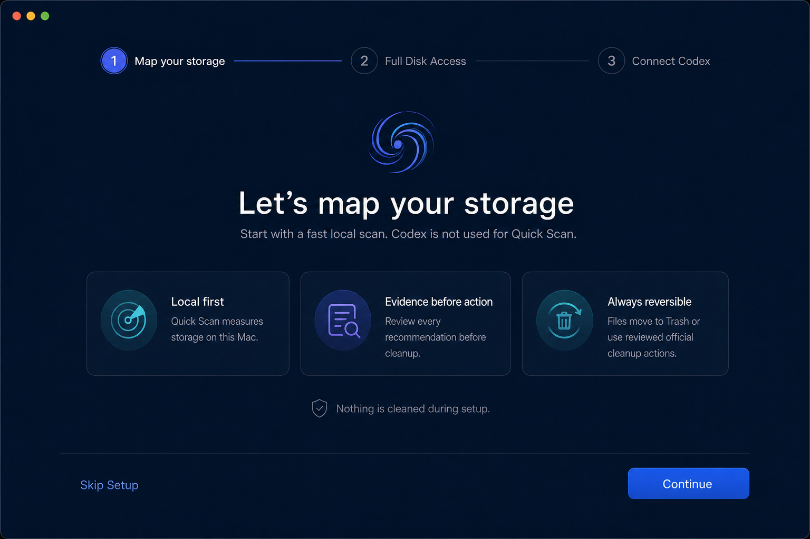

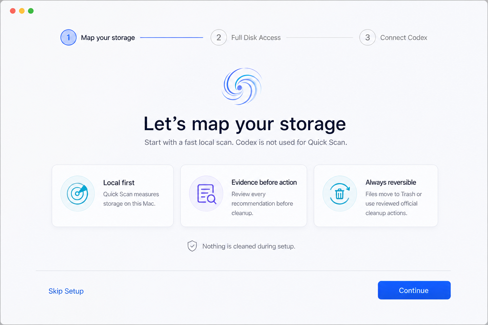

### Step 2 — Full Disk Access

- Explain the permission as improved measurement coverage, never as required access or a security emergency.
- Show Full Access benefits and a compact Limited Access consequence strip without invented percentages.
- Actions before opening Settings: `Back`, `Continue with Limited Access`, `Open System Settings`.
- After returning from Settings, replace the primary repair affordance with `Check Again`; a failed check keeps limited mode available and does not loop the system prompt.

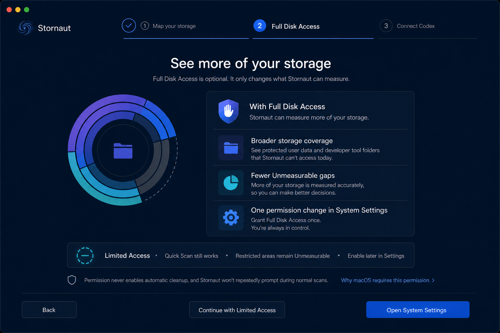

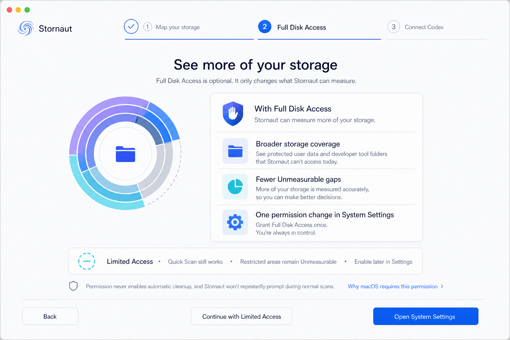

### Step 3 — Connect Codex

- Detect the user-installed Codex and present installation status separately from Deep Dive safety status.
- `Found` does not mean `Verified`. The controlled bridge must pass the technical Spike and runtime safety check before Deep Dive becomes available.
- If Codex is absent, incompatible, or the safety check fails, Quick Scan remains fully available and Deep Dive remains paused with a repair action.
- Actions: `Back`, `Continue without Codex`, `Finish Setup`; `Check Again` belongs to the installation status card.

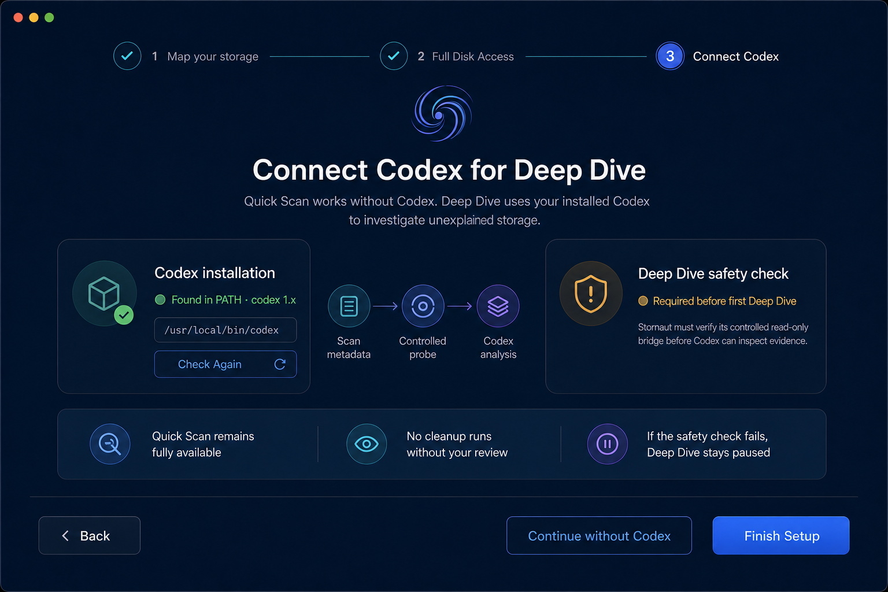

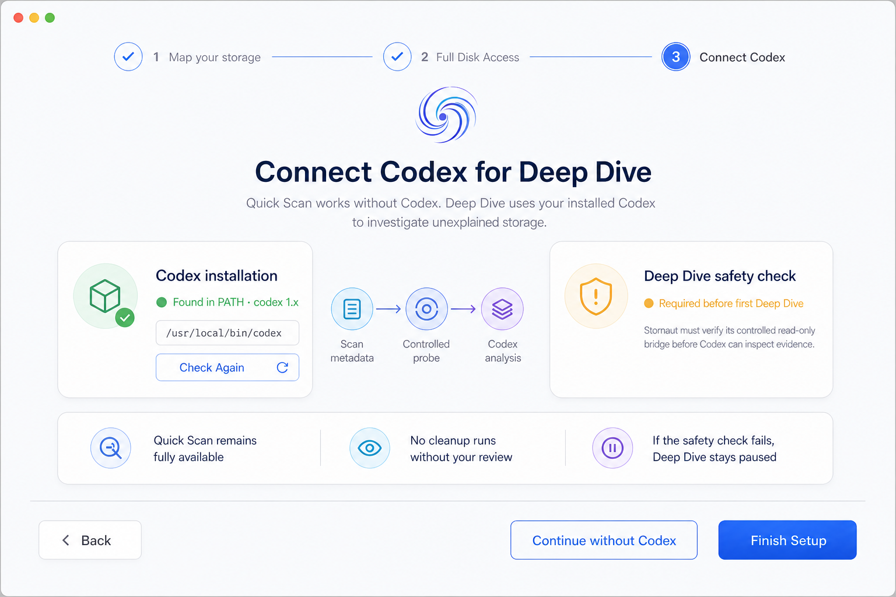

## Implementation boundary

The images establish hierarchy, theme pairing, and state separation. They are not literal implementation data. Generated paths, generic version text, icons, wrapping, and coverage graphics are illustrative. In particular, `/usr/local/bin/codex`, `codex 1.x`, and any apparent bridge capability must come from live detection and verified technical evidence, never hard-coded UI copy.
