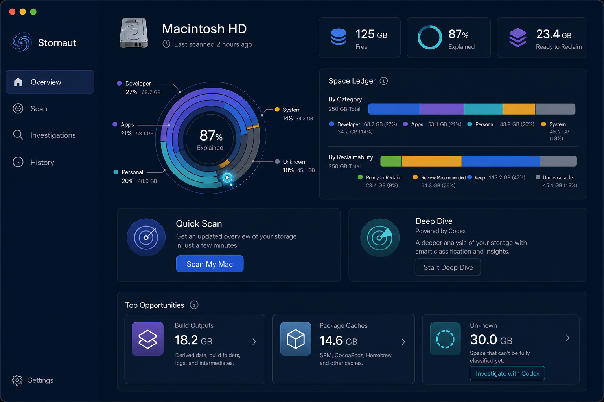
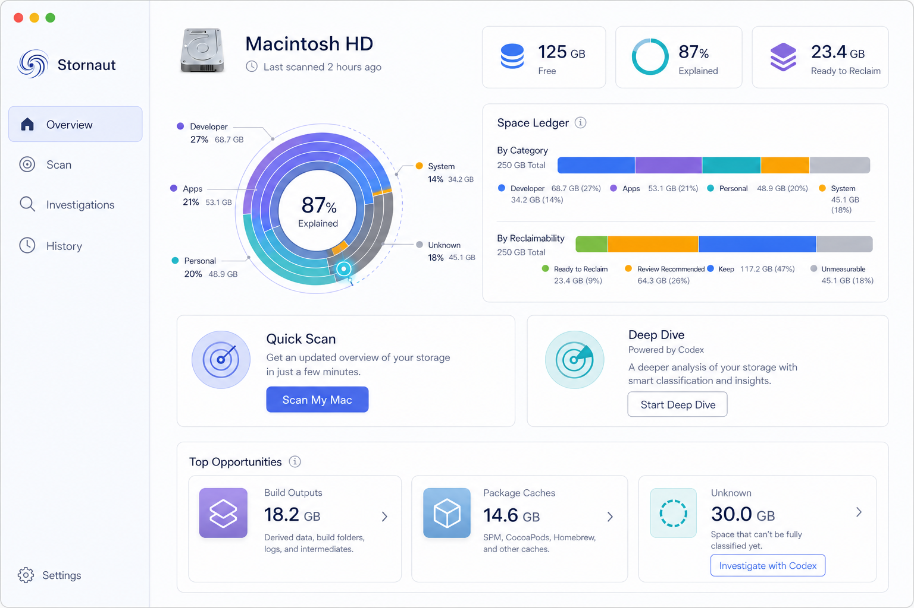
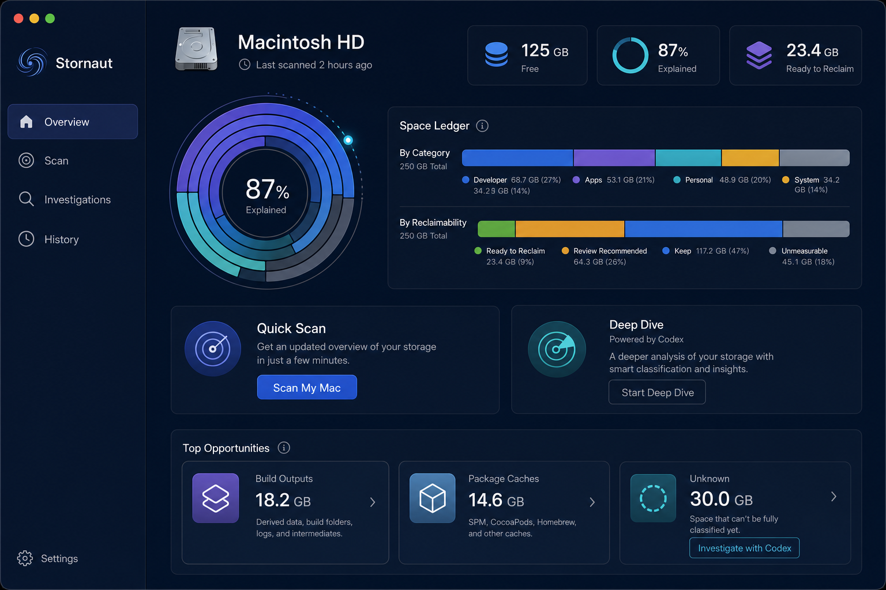
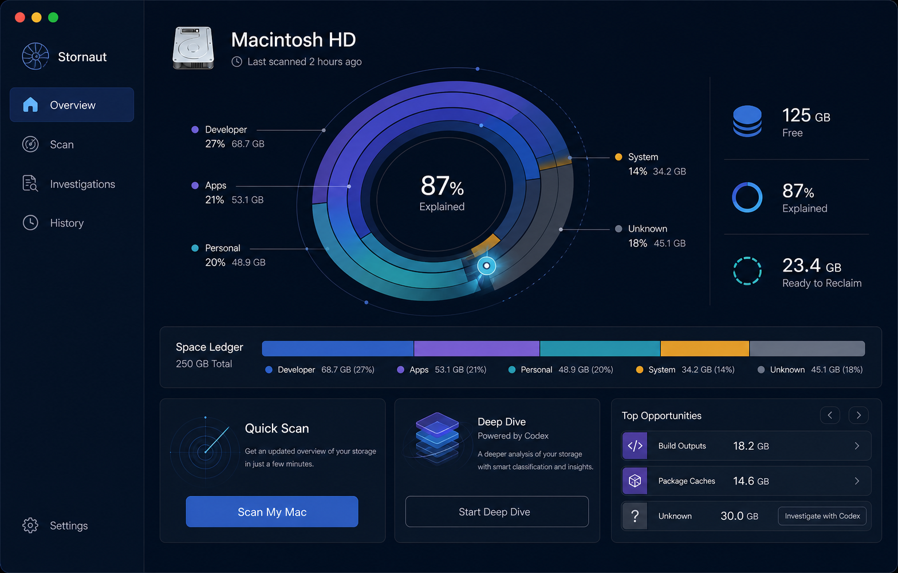
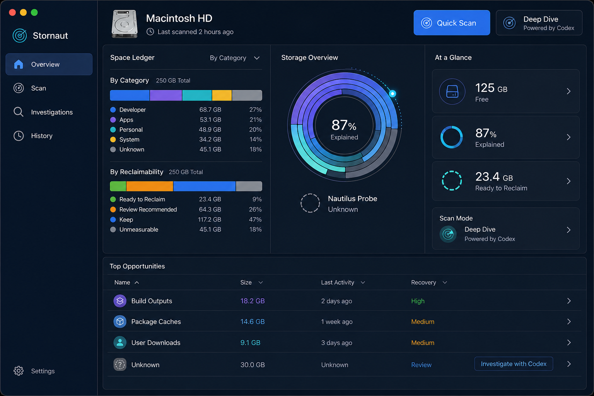

# Stornaut Overview — Round 2 Composition Draw

> Generated: 2026-08-07; canonical pair generated 2026-08-08  
> Tool: built-in `imagegen`  
> Status: selection complete — A+B direction approved; images remain non-pixel-authoritative references

## Approved decision

The user approved the recommended fusion on 2026-08-08:

- A provides the dominant information architecture, content order, and approachable density.
- B contributes only direct labels around the functional layered storage ring and the Nautilus Probe at the `Explained`/`Unknown` boundary.
- C's dense table language is reserved for Scan Results and Review.
- The user does not want a constellation/star-map aesthetic. The historical candidate name `Constellation` remains only for asset provenance; no star field, constellation line, or astronomical decoration enters the product language.

### Canonical dark reference

### Canonical light reference

The pair fixes composition and theme relationships, not generated-image pixels. Implementation must use semantic SwiftUI components, real localization, formatted data, and accessibility labels rather than tracing text or icons from the PNGs.

## Why Overview comes first

Overview establishes the product-wide visual grammar: sidebar density, surface treatment, storage visualization, data typography, action hierarchy, and how Codex appears. Selecting it before generating more screens prevents Overview, Deep Dive, and Review from looking like three unrelated products.

The winner will be adapted to system Light mode and then used as the source language for Deep Dive and Review. Theme adaptation must preserve hierarchy and semantics; it is not simple color inversion.

## Fixed constraints

- Native macOS SwiftUI/AppKit, landscape 16:10, system Light/Dark capable.
- Native Observatory: calm, scientific, precise, and approachable.
- Sidebar contains only `Overview`, `Scan`, `Investigations`, and `History`; Settings is separate.
- Metrics are `125 GB Free`, `87% Explained`, and `23.4 GB Ready to Reclaim`.
- `Quick Scan` is the only filled primary action; `Deep Dive` is secondary.
- Known-rule items have no AI decoration. Only `Unknown` may offer `Investigate with Codex`.
- Nautilus Probe appears once as the brand mark and functionally at an unknown/investigation boundary.
- Palette: `#07152E`, `#3F469A`, `#6573E6`, `#32D6F4`, `#FFB547`, `#EAFBFF`.
- No chat, terminal, paywall, menu-bar companion, cyberpunk treatment, decorative sparkles, or extra destinations.

## Candidate A — Orbit Ledger

Fuses the earlier visual orbit with the earlier balanced dashboard. The upper area pairs a medium storage orbit with three key metrics and a readable two-axis Space Ledger. Scan modes and Top Opportunities remain visually separate.

Prompt direction: “Create a high-fidelity native macOS Stornaut Overview named Orbit Ledger. Fuse a calm multiring storage orbit with a readable Space Ledger, preserve a single Quick Scan primary action, make Deep Dive secondary, and expose Codex only on Unknown.”

Strengths: fastest comprehension, practical SwiftUI composition, clear scan-mode distinction.  
Risk: more conventional and card-based than B.

## Candidate B — Constellation

Historical exploration name only; its constellation metaphor was rejected. Only direct labels and functional Probe placement were retained.

Uses the storage orbit as the primary explanatory object. Fine leader lines directly label categories; the Nautilus Probe sits at the Explained/Unknown boundary. The Space Ledger becomes a slim verification strip and cards recede.

Prompt direction: “Create a spacious native macOS Stornaut Overview named Constellation. Center an asymmetric labeled storage orbit with a functional probe at the unknown boundary, preserve a slim ledger and one primary Quick Scan action, and avoid game HUD or star-field styling.”

Strengths: strongest identity, least text, most memorable explanation of unknown space.  
Risk: large visualization consumes room and requires careful accessibility fallback.

## Candidate C — Native Console

Uses a three-column professional instrument workspace: ledger, orbit, and metrics/actions, followed by a native Top Opportunities table. “Console” means an instrument panel, never a terminal.

Prompt direction: “Create a compact native macOS Stornaut Overview named Native Console. Use a three-column ledger/orbit/metrics workspace and a sortable opportunity table, with progressive disclosure, tabular figures, and no terminal or command-line aesthetic.”

Strengths: highest information efficiency, strongest expert utility, excellent comparison and scanning.  
Risk: denser first impression for a user who only wants a quick answer.

## Selection rubric

Choose the composition that best balances these questions:

1. Can `Free`, `Explained`, `Ready to Reclaim`, and `Unknown` be understood in ten seconds?
2. Does `Quick Scan` remain the obvious default while `Deep Dive` feels valuable but optional?
3. Does Codex feel like an investigation capability rather than an omnipresent mascot?
4. Is the screen calm enough for occasional users and useful enough for developers?
5. Can the same grammar extend naturally to Light mode, Deep Dive, and Review?

Decision: A is the base, B's labeled-orbit/probe behavior is merged into Overview, and C's table density is used only where Scan Results or Review need it.

## Canonical generation prompts

The dark prompt used A as the dominant reference and B only for direct orbit labels and Probe behavior. It explicitly preserved the sidebar, metric cards, medium orbit, full two-row Space Ledger, scan-mode cards, Top Opportunities, and single filled Quick Scan action.

The light prompt treated the dark canonical image as an exact composition invariant and changed only semantic theme materials: `#F4F7FB` canvas, white elevated surfaces, `#10213D` primary text, `#526078` secondary text, `#D7E0EC` borders, accessible indigo/cyan/amber accents, and restrained native shadows. It prohibited simple inversion, glass, neumorphism, low contrast, and layout changes.
