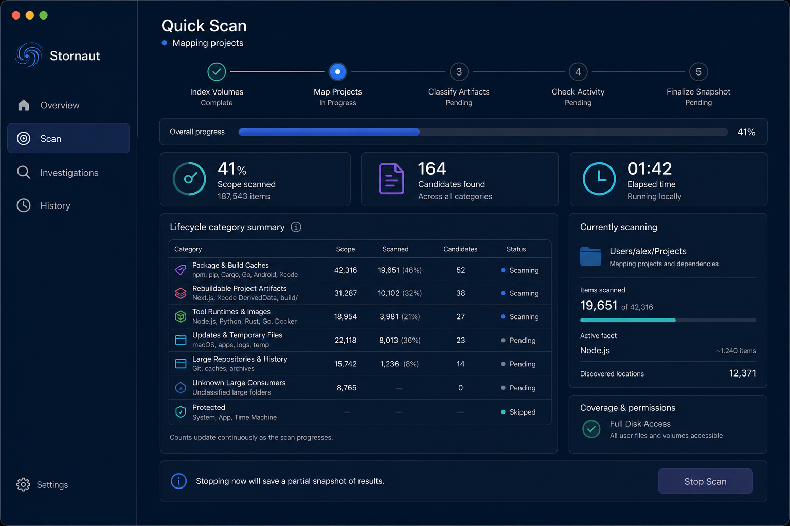
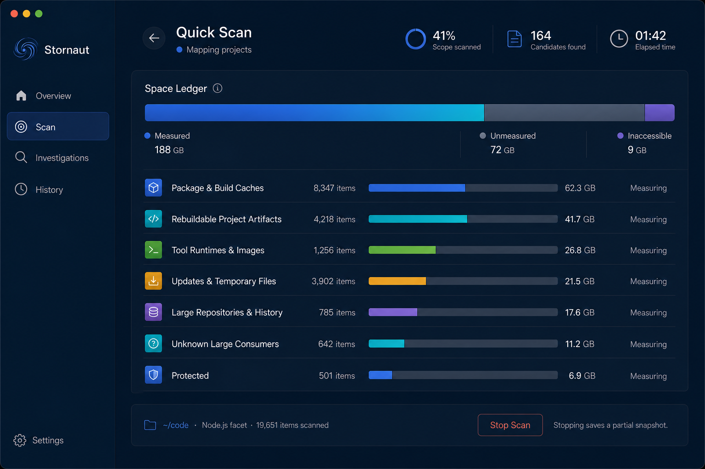
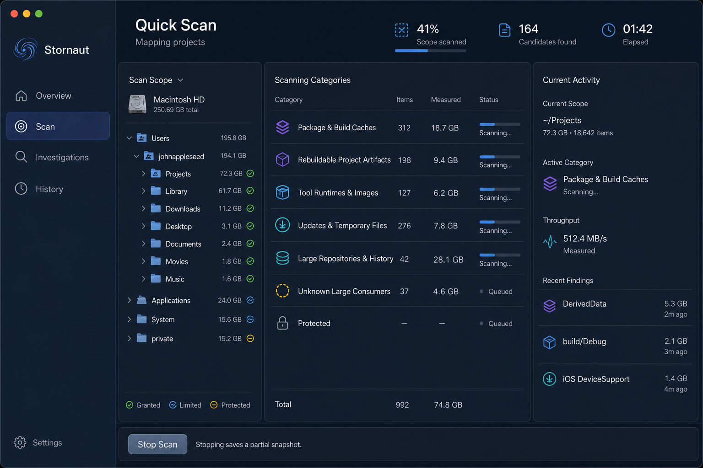
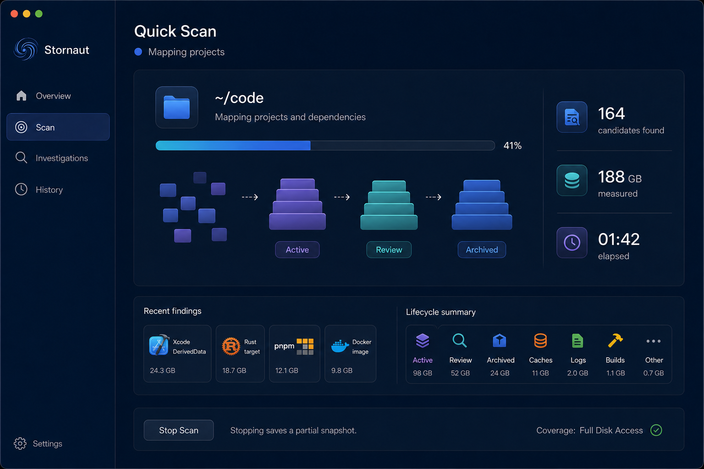
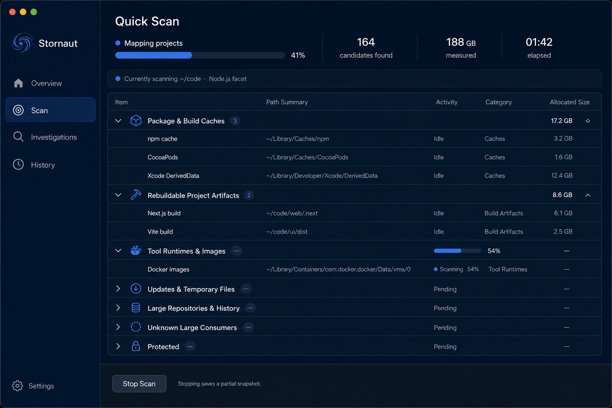
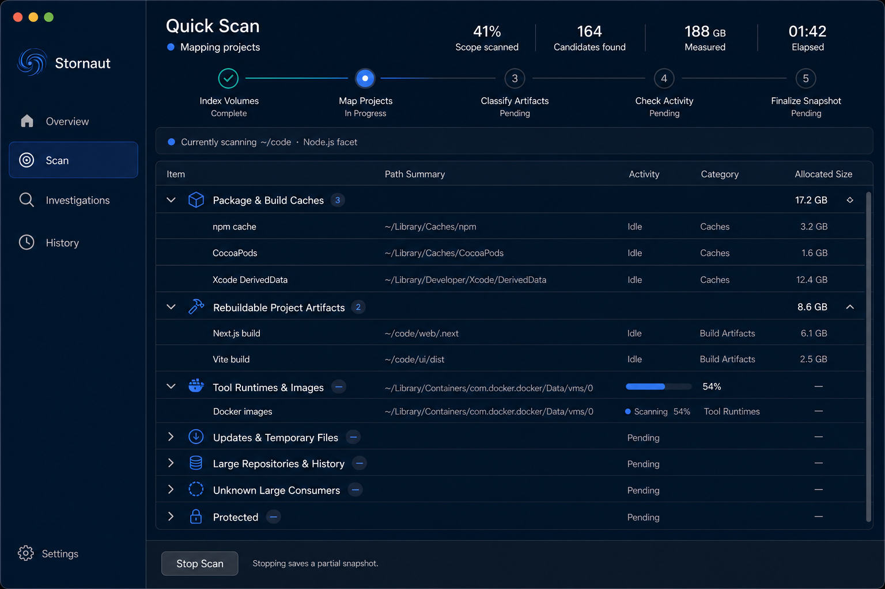
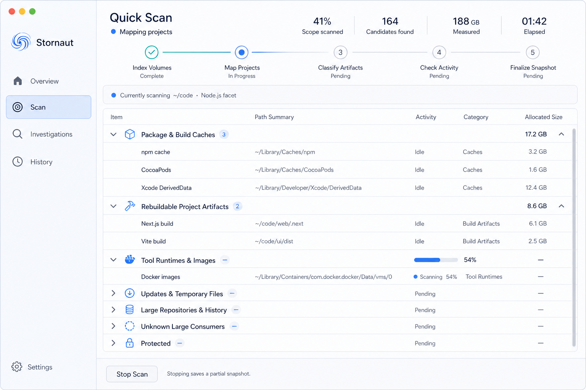

# Stornaut Quick Scan Progress — Internal Draw

> Generated: 2026-08-08  
> Tool: `$erik-gpt-image-2` / OpenAI `gpt-image-2`
> Status: internally reviewed; E+A direction approved without a user tie-break

## Fixed product grammar

- Quick Scan is deterministic local Swift scanning. It does not invoke Codex or consume model tokens.
- The active workspace is `Scan`; Quick Scan is not a separate sidebar destination.
- The page always shows phase, honest progress, scanned scope, candidate count, elapsed time, coverage, and partial results.
- `Stop Scan` preserves a partial snapshot. Scanning never exposes cleanup controls or implies that bytes have been reclaimed.
- Primary grouping is artifact lifecycle. Node.js, Python, Rust, Go, Android, Xcode, Next.js, Homebrew, and Docker are facets or row details.
- No Agent, Nautilus Probe, chat, terminal, raw log, orbit, circular chart, or decorative astronomical visual appears during Quick Scan.

## Candidate draw

### A — Stage Rail

Best stage comprehension and status reassurance. Its separate metrics, summary table, and current-scope panel duplicate some information and would require a larger layout transition when results complete.

### B — Growing Ledger

Strong visual explanation of measured versus unmeasured space. It under-explains the scientific scan phases, and the generated red `Stop Scan` treatment is rejected because stopping is not a destructive disk action.

### C — Native Operations

Highest observability and strongest expert utility. The three simultaneous panes are too dense for the default scan state and expose more scope detail than most users need while waiting.

### D — Focus and Discoveries

Most approachable and visual. Rejected because the image drifted into `Active / Review / Archived`, which is not the approved lifecycle model, and because the abstract block animation consumes space without improving auditability.

### E — Results Taking Shape

Best continuity: the grouped outline/table fills progressively and becomes the final results surface without a full-page reflow. By itself it needs a clearer answer to “which scientific phase is running?”

## Approved composition

Use E as the dominant composition and add A's compact five-stage rail:

1. `Index Volumes`
2. `Map Projects`
3. `Classify Artifacts`
4. `Check Activity`
5. `Finalize Snapshot`

Completed, active, and pending stages use icon, label, and state text rather than color alone. The grouped table remains the dominant body; completed groups show stable totals, the active group shows inline progress, and pending groups show `Pending` plus dashes instead of fabricated values.

### Canonical references

These images establish composition and theme relationships, not literal implementation data. Paths, item counts, icons, wrapping, and sample scan values remain illustrative.
