# Resilience States — Cross-flow Round 1

Approved on 2026-08-08. This round defines the shared failure, partial-result, stale-data, and retention behavior across Stornaut. The images are concept references; the behavioral rules in this document and the UI/UX specification are authoritative.

## Selected recovery grammar

Stornaut uses **page-preserving recovery**:

1. Preserve every completed, still-valid result in place.
2. Mark the unfinished, unmeasurable, blocked, or stale scope precisely.
3. Explain the consequence in one short sentence.
4. Offer one safe primary recovery action and, when useful, one quiet secondary action.
5. Keep technical details behind a disclosure or Inspector.

Do not replace the page with a generic error modal or create a separate Recovery Center. A sheet is reserved for a decision that must block execution, such as stale preflight evidence.

## Severity and visual semantics

| State | Color role | Meaning | Default action behavior |
|---|---|---|---|
| Informational | neutral/blue | Completed result, retained history, or optional detail | Existing safe navigation remains available |
| Limited/partial/stale | neutral/amber | Some scope is unavailable, unfinished, or requires refresh | Unsafe or stale actions are disabled; recovery remains available |
| Failed | red, used locally | A concrete operation failed or a record is corrupt | Preserve unaffected results and isolate the failed row |
| Protected/blocked by policy | neutral/indigo with lock/shield | Safety boundary intentionally stopped work | No bypass action |

Red is not used for missing FDA, exhausted budgets, stale snapshots, or Codex absence unless an actual operation has failed. Unmeasurable space is shown as `Unknown` or an em dash, never `0 B`.

## 1. Quick Scan with limited coverage

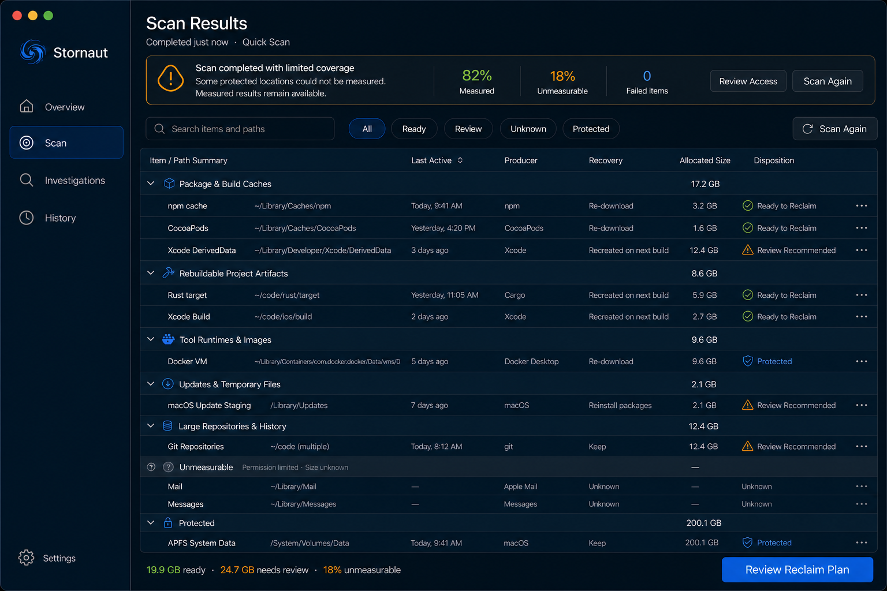

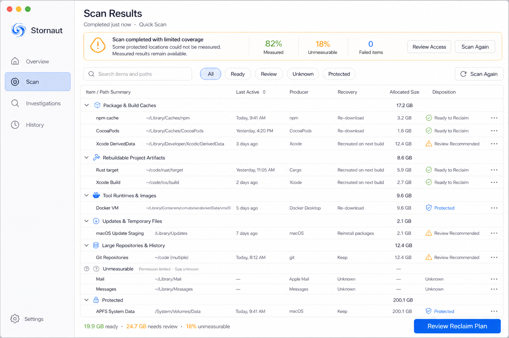

The page keeps measured results usable and labels the unmeasurable portion separately. `Review Reclaim Plan` may remain available only for measured, current `Ready to Reclaim` items. Mail, Messages, or another inaccessible scope cannot contribute a guessed size or disposition. The primary recovery action opens the relevant permission guidance; scanning never enters an authorization loop.

## 2. Deep Dive blocked by the safety check

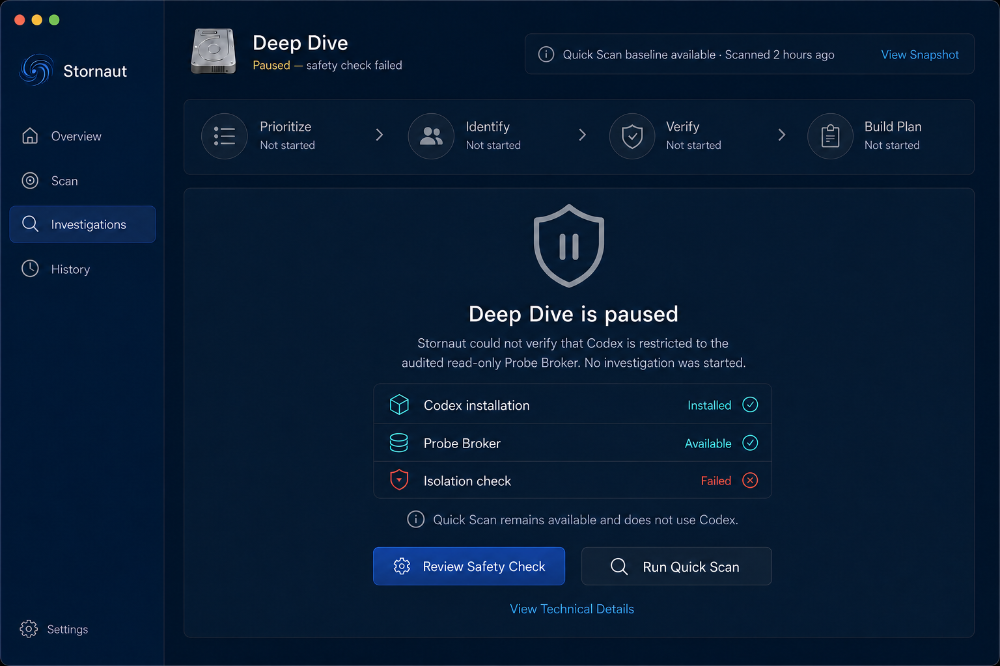

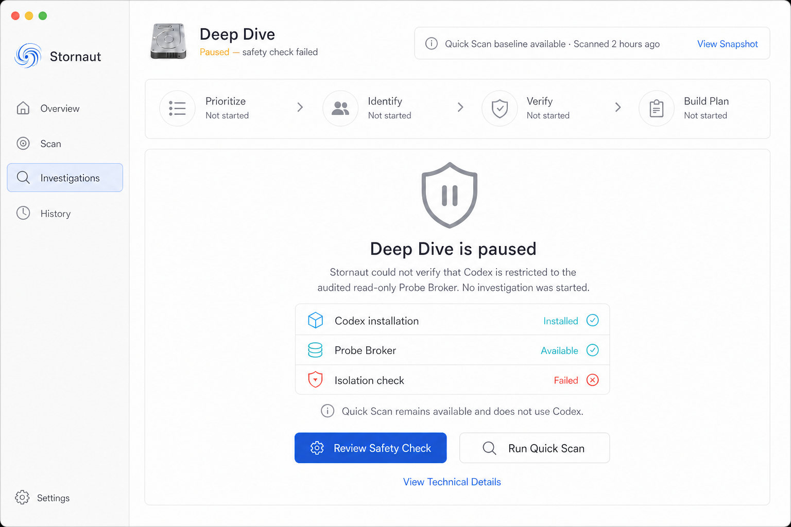

Codex discovery and Probe Broker availability are shown as separate facts from isolation verification. If isolation fails, all investigation stages remain `Not started`, no finding count or explained-space gain is claimed, and Deep Dive stays paused. `Review Safety Check` is the primary action; `Run Quick Scan` is the safe fallback. There is no “continue anyway” control.

The rejected draft below retained stale success metrics while saying the investigation had not started. It is preserved only as a design-audit example and must not be implemented.

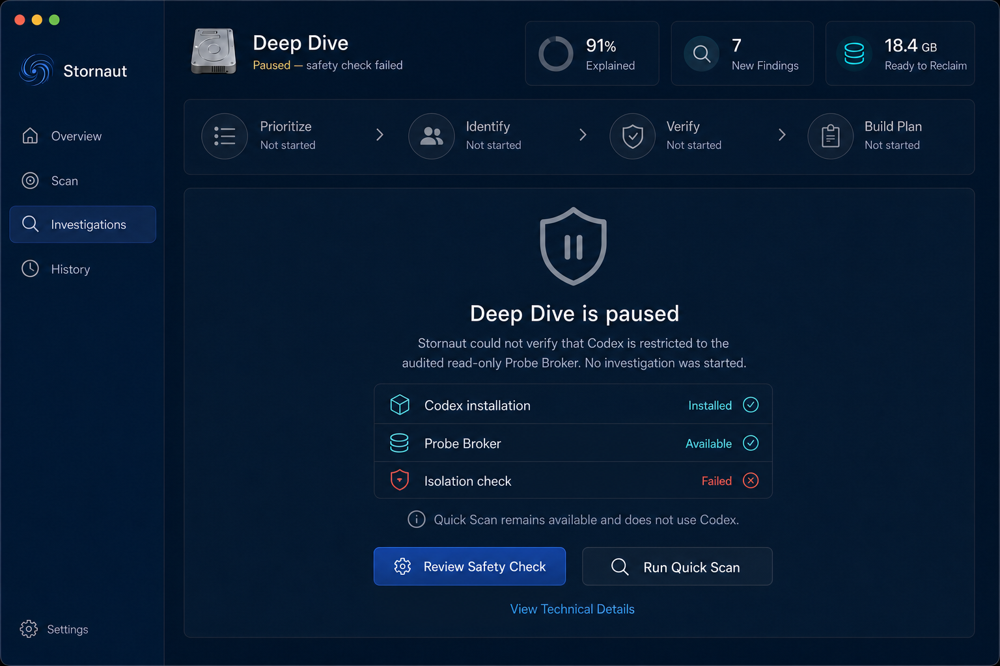

## 3. Stale reclaim plan at execution preflight

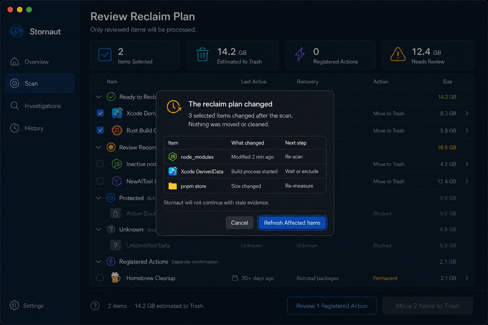

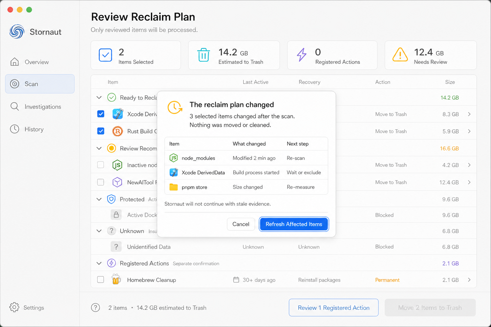

Preflight freezes the Review page and opens a native sheet listing only affected items and the reason each changed. No action has run. The reclaim CTA is disabled and there is no `Proceed Anyway`. `Refresh Affected Items` remeasures and returns the user to Review with selection recalculated; `Cancel` closes the sheet while leaving the plan visibly stale and non-executable.

## 4. Partial Deep Dive after budget exhaustion or cancellation

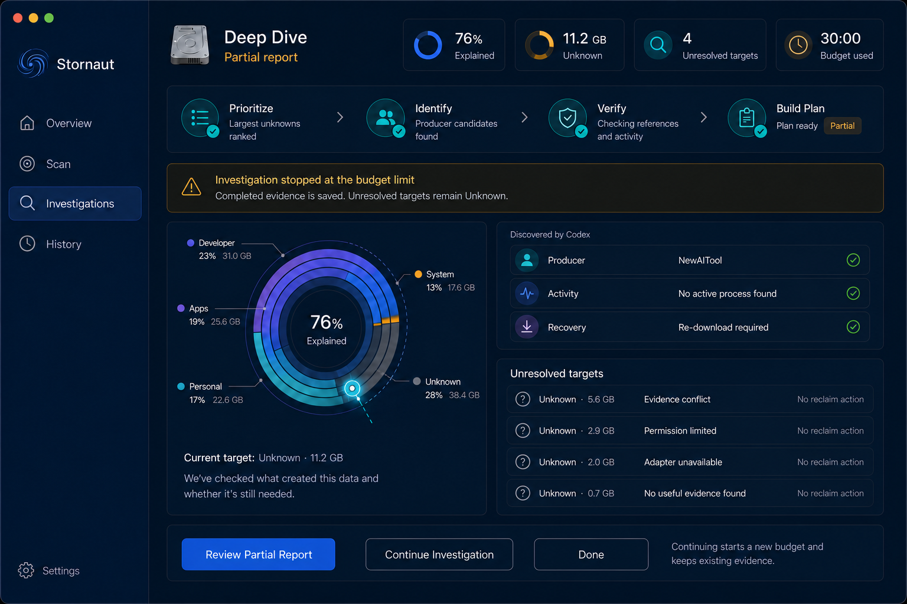

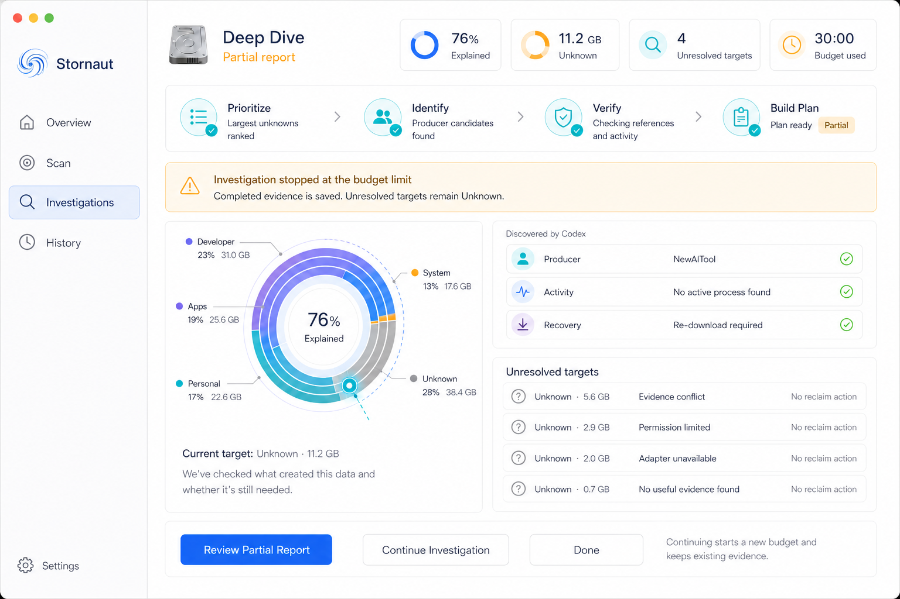

Verified findings and measured progress remain visible. Unresolved targets stay `Unknown`, with a short reason such as `Budget exhausted`, `Cancelled`, or `Adapter unavailable`. The report offers `Review Partial Report`, `Continue Investigation`, and `Done`; it never exposes a cleanup action. Continuing creates a new bounded investigation segment rather than silently extending the expired budget.

## 5. History with expired evidence and an isolated corrupt record

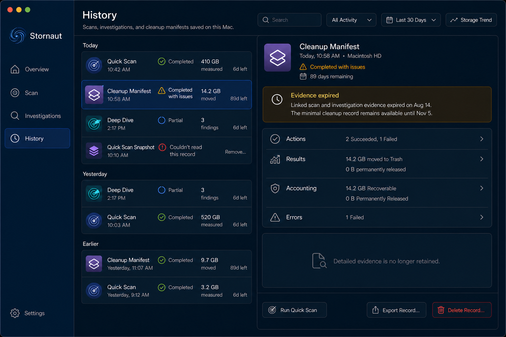

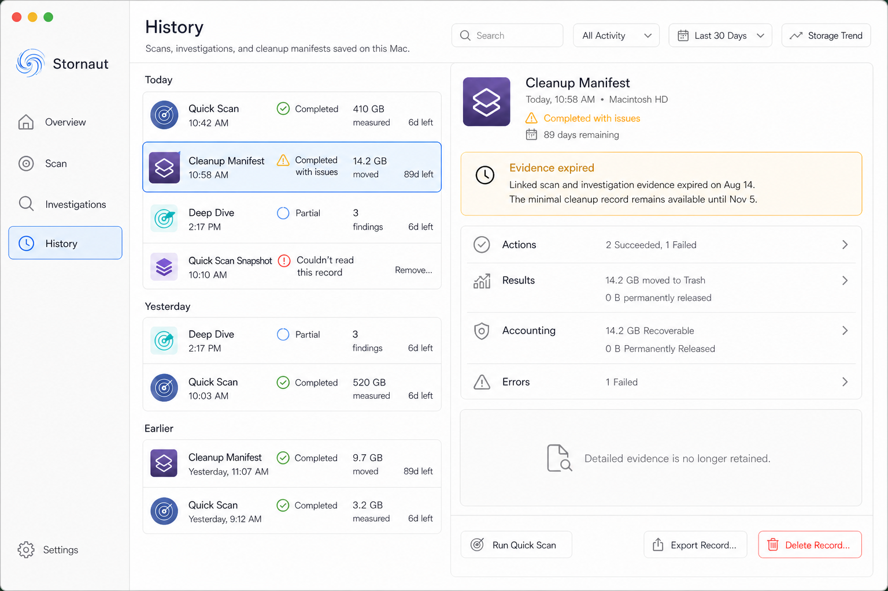

After linked Evidence expires, the minimum Cleanup Manifest still shows action identity, policy disposition, accounting, result, and errors until its own 90-day retention expires. The evidence area becomes an explicit `Evidence expired` placeholder. A corrupt record is isolated to its navigator row and cannot prevent other history from loading, exporting, or being deleted.

## Cross-flow behavior matrix

| Trigger | Preserved state | Blocked or degraded scope | Safe recovery |
|---|---|---|---|
| FDA/TCC limited | Measured snapshot and current findings | Inaccessible roots are unmeasurable | Open System Settings, then Check Again or continue limited |
| Codex missing/not logged in | Quick Scan and previous reports | New Deep Dive | Diagnose Codex; run Quick Scan |
| Isolation safety check fails | Quick Scan baseline and diagnostic facts | Entire Deep Dive session | Review Safety Check; no bypass |
| Adapter missing/incompatible | Other probes and verified findings | Adapter-specific evidence | Explain gap; retry after adapter repair |
| Agent output fails Schema | Valid evidence collected before failure | Proposed conclusion/disposition | Keep target Unknown; retry bounded investigation |
| Budget exhausted/user stops Deep Dive | Verified partial report | Unresolved targets | Review partial report or continue with a new budget |
| User stops Quick Scan | Completed streamed measurements | Unvisited roots | Save a clearly partial snapshot; resume with a new scan |
| Target changes during investigation | Other current findings | Changed target and dependent conclusion | Re-probe that target |
| Plan changes before execution | Frozen Review context | Changed selected rows and primary execution CTA | Refresh affected items or cancel |
| Trash operation fails | Successful rows and their recovery paths | Failed row; original remains in place | Show failure detail; never permanent-delete fallback |
| Registered Action fails | Prior successful actions and manifest entries | Current action and dependent follow-ups | Stop that action; show official recovery guidance |
| Manifest persistence fails | In-memory execution results | Audit durability and completion claim | Report separately; retry persistence/export before normal completion |
| Evidence expires | Minimum manifest | Linked raw/derived evidence detail | Run a new scan; never reconstruct old evidence from guesses |
| History record is corrupt | Every healthy record | Only the corrupt row | Isolate, allow delete, and keep History usable |

## Cancellation contract

- `Stop Scan` saves a partial snapshot with explicit coverage and unfinished roots.
- `Stop Deep Dive` terminates the Codex process tree, saves verified evidence, and leaves unresolved targets `Unknown`.
- Cancelling the stale-plan sheet executes nothing; the plan remains non-executable until refreshed.
- Cleanup cancellation is only offered before execution or between typed actions. Once an individual Trash or Registered Action has started, the UI changes to `Stop After Current Action`; exact filesystem atomicity and recovery behavior come from the Trash/Action lifecycle Spike and ADR, not from a visual assumption.

## Interaction and accessibility

- Keyboard focus moves to the inline status heading or blocking sheet heading once, without trapping the user.
- Every enabled control keeps a visible macOS focus ring; disabled stale/blocked actions are visually distinct and expose a short accessible reason.
- VoiceOver announces state, affected scope, preserved result, and recovery action in that order.
- Status never relies on color alone; use an icon, short label, and consequence text.
- Icon-only controls have localized accessible names, and normal-size text meets at least 4.5:1 contrast in both themes.
- Loading indicators appear only for active work. A blocked or stale state is not shown as indefinite progress.
- Reduce Motion replaces animated transitions with a static status change while preserving progress values.
- Retry controls are idempotent and cannot duplicate cleanup actions.

## Prompt set used for this round

Shared direction: high-fidelity native macOS Stornaut UI; identical Light/Dark hierarchy; four-item sidebar; calm Native Observatory visual language; restrained indigo/cyan with semantic amber/red; preserve valid page content; concise English; no chat, terminal, paywall, constellation, generic alert takeover, unsafe bypass, or cleanup action outside Review.

- **Limited coverage:** Quick Scan results with measured and unmeasurable space separated, useful measured findings preserved, permission recovery inline.
- **Safety blocked:** Deep Dive paused before any stage starts; Codex installed, Broker available, isolation failed; no success metrics or bypass.
- **Stale preflight:** frozen Review context with a native blocking sheet, affected-item diff, refresh/cancel only.
- **Partial investigation:** budget exhausted with verified partial evidence, unresolved Unknown targets, continue/review/done actions.
- **Expired evidence:** History master-detail with retained minimum Manifest, explicit expired-evidence placeholder, and one isolated corrupt record.

All names, paths, dates, sizes, counts, versions, and findings in generated images are fixtures. Production UI must render typed runtime state and localized strings.
