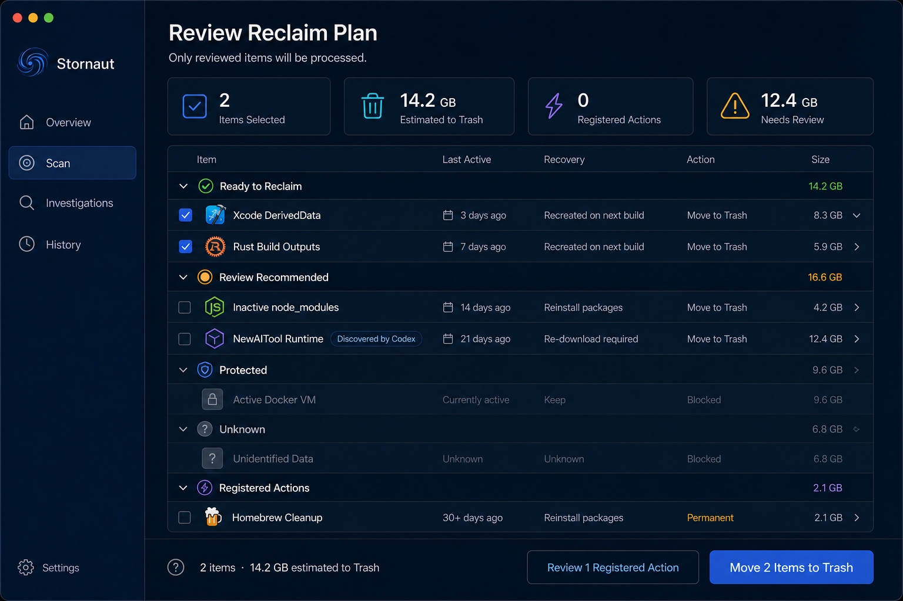
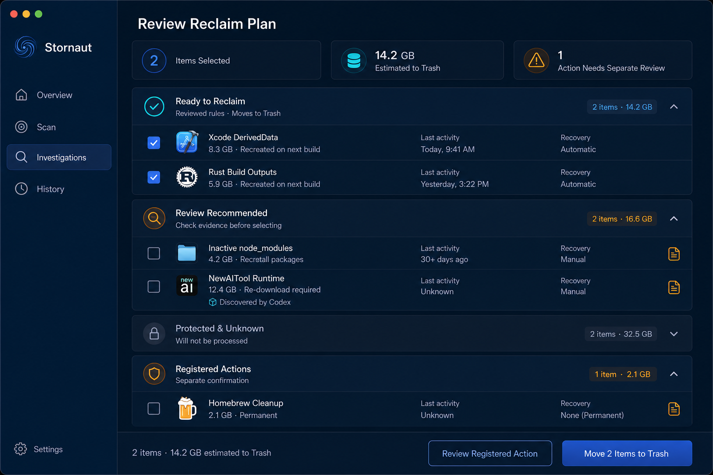
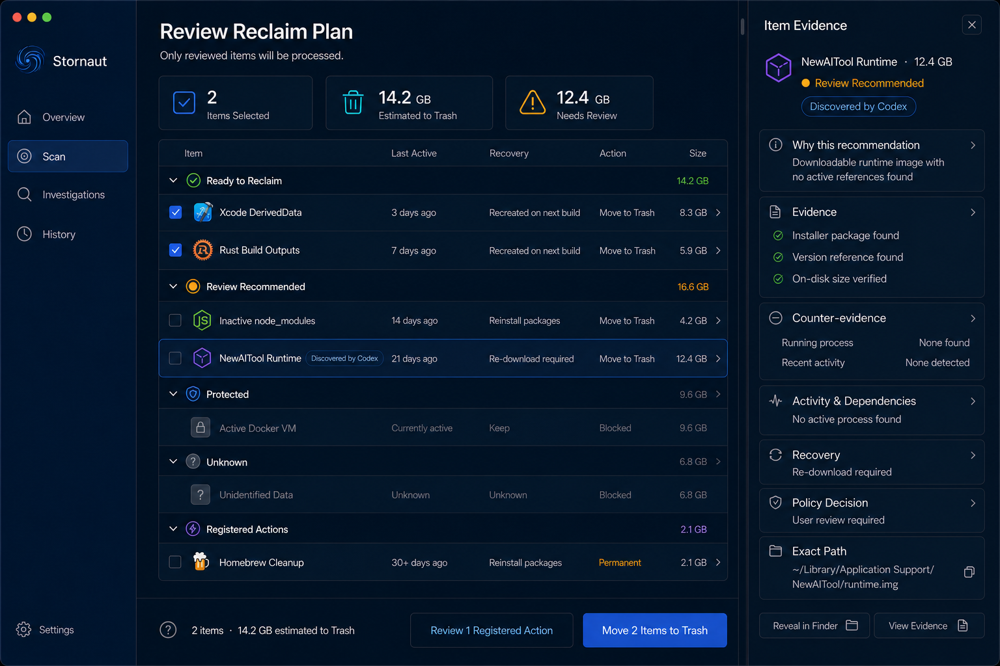

# Stornaut Review Reclaim Plan — Round 2 Draw

> Generated: 2026-08-08  
> Tool: `$erik-gpt-image-2` / OpenAI `gpt-image-2`
> Status: selection approved; canonical Dark/Light references generated

## Fixed product and safety grammar

- Review is a sub-flow under `Scan`, not a sidebar destination.
- Only `Ready to Reclaim` is selected by default.
- `Review Recommended` and `Registered Actions` are unchecked by default.
- `Protected` and `Unknown` are disabled and cannot be forced through the UI.
- Registered Actions use a separate review/confirmation flow; Permanent actions never share the Trash CTA.
- The primary action is `Move N Items to Trash`. It uses item count and does not promise that an estimated byte total has already become free space.
- Selected item count, estimated Trash bytes, selected Registered Actions, permanent release, and observed free-space delta remain distinct values.
- `Discovered by Codex` is an evidence-source badge only; it never changes default selection policy.
- No star field, constellation, circular chart, chat, terminal, or Agent decoration appears in Review.

## A — Decision Table

A native grouped outline/table with Item, Last Active, Recovery, Action, and Size columns. All five disposition/action groups are visible, and the bottom action bar separates Trash from Registered Actions.

Strengths: fastest comparison, clearest selection state, best use of C's previously approved high-density language for Review.  
Risk: denser and more expert-looking than B.

Prompt direction: use a compact native table, show every group and disabled state, default-check only Ready to Reclaim, and keep `Move 2 Items to Trash` as the only filled action.

## B — Decision Cards

Expandable cards add one-line explanations to each decision group and present each row in a more approachable two-line format.

Strengths: friendlier for occasional users, clearer group meaning, comfortable row hit areas.  
Risk: lower information density and slower cross-row comparison.

Prompt direction: use four calm expandable cards, keep all unsafe groups unchecked/disabled, and separate Registered Actions without a combined reclaim meter.

## C — Evidence Inspector

This is not a competing default layout. It is A with the unselected `NewAITool Runtime` row focused and a native right-side Inspector open. The Inspector shows evidence, counter-evidence, activity/dependencies, recovery, policy decision, and exact path, but offers no cleanup action.

Strengths: highest auditability, preserves selection safety, keeps technical evidence out of the default table.  
Risk: reduced table width while open.

Prompt direction: preserve A's exact selections and bottom actions, keep the focused Review Recommended row unchecked, and add only read-only evidence/reveal controls in the Inspector.

## Approved composition

Approved 2026-08-08: use A as the default Review composition and C as its on-demand Inspector state. Borrow B's one-line group explanations as secondary text in A's group headers. This keeps the high-density decision surface efficient while still explaining each safety bucket to less technical users.

- `review-canonical-dark.png` — canonical dark default Review reference.
- `review-canonical-light.png` — canonical light counterpart with the same hierarchy and safety state.
- `review-round2-c-evidence-inspector-dark.png` — canonical on-demand Inspector behavior reference until its theme pair is produced.

The canonical group explanations are:

- Ready to Reclaim — `Reviewed rules · Moves to Trash`
- Review Recommended — `Check evidence before selecting`
- Protected — `Active or policy blocked`
- Unknown — `Insufficient evidence · Will not be processed`
- Registered Actions — `Separate confirmation`

## Known image-generation drift

- Candidate B incorrectly highlights `Investigations` in the sidebar. The canonical selection is `Scan`; this is image-model drift.
- Example icons, exact values, activity dates, recovery wording, wrapping, and spacing are illustrative. Domain data and the registered-action catalog are authoritative.
- `Homebrew Cleanup` is shown only as an example Registered Action. Its real recovery/permanence label must come from the reviewed action descriptor, not from the concept image.
- Candidate C's focused NewAITool row remains unchecked; focus/selection highlight must never imply execution selection.
