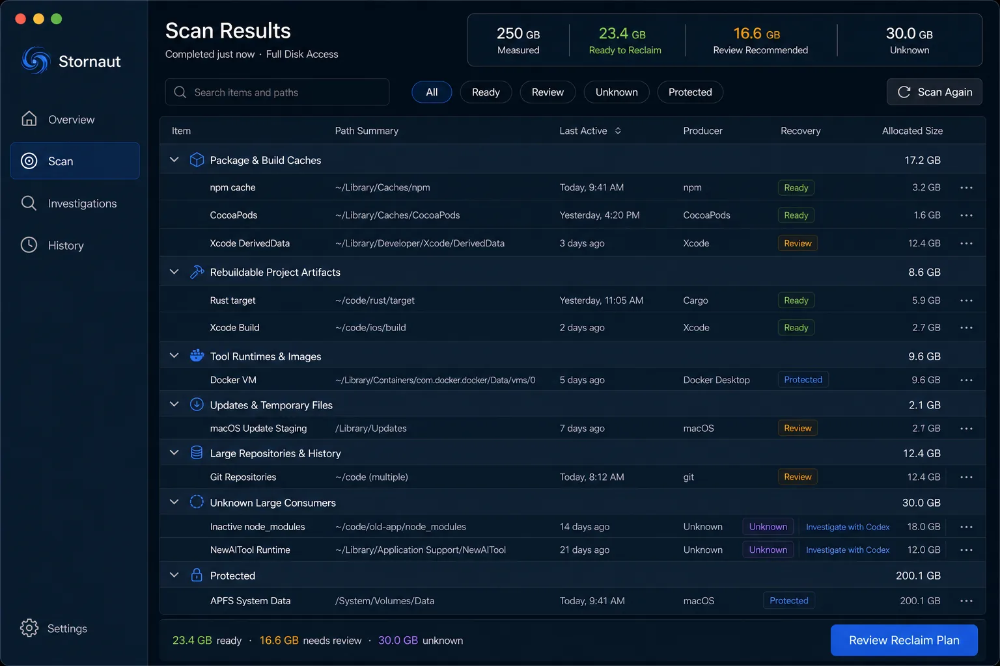
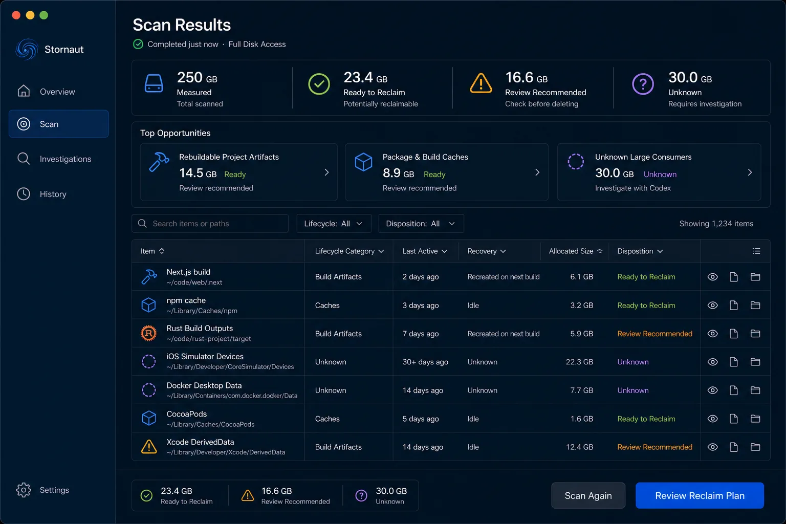
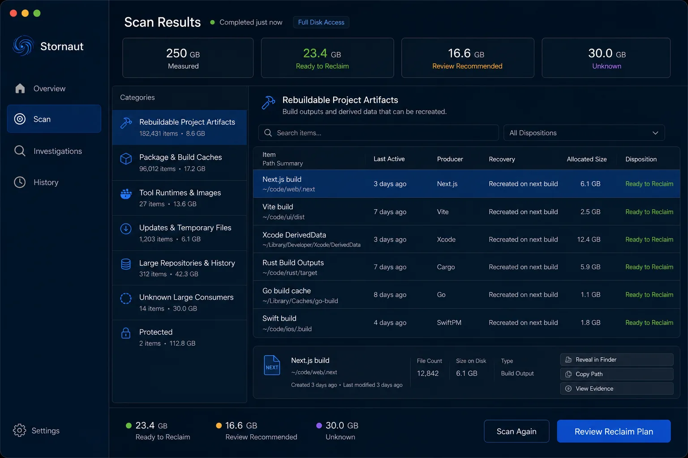
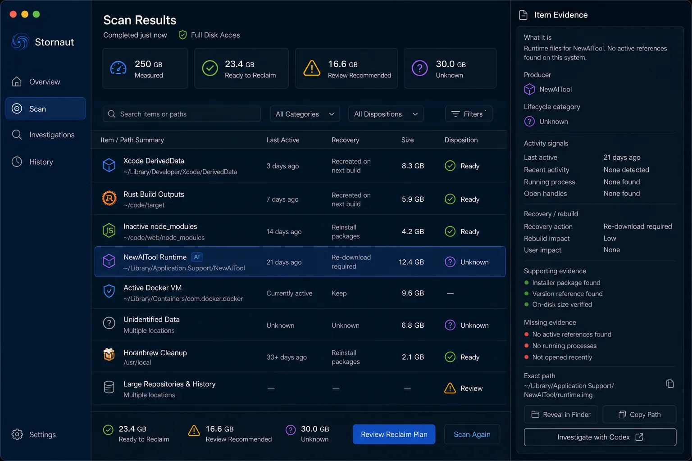
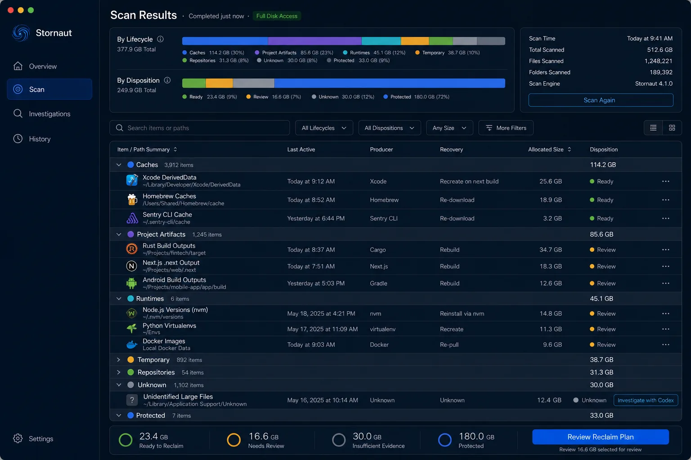
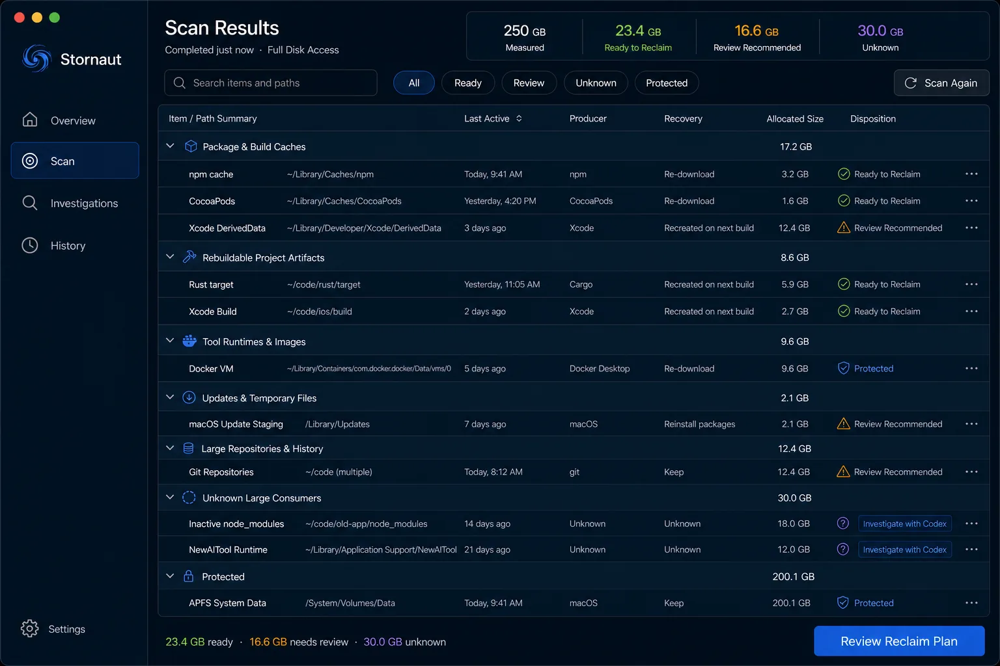
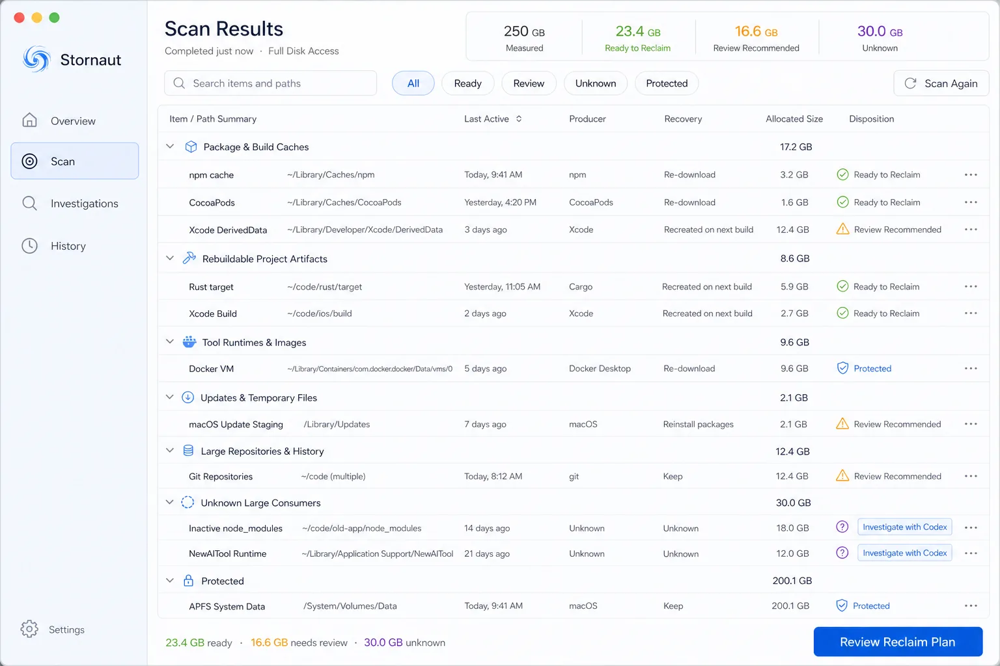

# Stornaut Scan Results — Internal Draw

> Generated: 2026-08-08  
> Tool: `$erik-gpt-image-2` / OpenAI `gpt-image-2`
> Status: internally reviewed; A default + D Inspector direction approved without a user tie-break

## Fixed product grammar

- Scan Results is the completed state of the `Scan` workspace, not a new destination.
- Results present scan facts and dispositions; they do not select items or execute cleanup.
- `Recovery` and `Disposition` are separate fields.
- Known-rule rows have no AI decoration. Unknown/rule-miss rows may offer `Investigate with Codex` as a secondary action.
- `Review Reclaim Plan` is the only filled primary action. `Scan Again` is secondary.
- Measured, Ready to Reclaim, Review Recommended, Unknown, and Protected values are not combined into a false “freed” number.

## Candidate draw

### A — Lifecycle Outline

Strongest default composition: a familiar search/filter bar and grouped native outline make lifecycle, path, producer, activity, recovery, size, and disposition directly comparable. The first generation conflated recovery and disposition; the canonical redraw corrects this.

### B — Opportunity First

Friendly and scannable, but duplicates Overview's `Top Opportunities`, delays access to the full evidence set, and produced ambiguous opportunity-card copy. Rejected as the default Results hierarchy.

### C — Category Navigator

Excellent focused browsing for one lifecycle category. Rejected as the default because a second persistent category sidebar competes with the app sidebar. Its category counts can inform filter menus and accessibility summaries.

### D — Evidence Inspector

Approved as an on-demand state, not the default page. The generated `AI` badge is rejected; focus does not change disposition, and missing evidence is neutral/amber information rather than a red error. The Inspector remains read-only except for Reveal, Copy, View Evidence, and the eligible `Investigate with Codex` action.

### E — Ledger plus Results

Powerful expert summary, but too dense as the default. Its two-axis horizontal ledger may become a collapsed `Snapshot Summary` disclosure; it does not remain permanently open above the table.

## Approved composition

Use A as the default grouped lifecycle outline and D as the optional right Inspector state.

- Columns: `Item / Path Summary`, `Last Active`, `Producer`, `Recovery`, `Allocated Size`, `Disposition`.
- No checkboxes appear in Results. Selection begins only in Review.
- Search and disposition filters remain above the table.
- Row overflow contains `Reveal in Finder`, `Copy Path`, and `View Evidence`.
- The bottom summary keeps Ready, Review, and Unknown distinct and leads to `Review Reclaim Plan`.
- E's two-axis ledger is allowed only as a collapsed/on-demand summary.

### Canonical references

The pair fixes hierarchy, field separation, and action boundaries. Example paths, sizes, item names, dates, and icons are illustrative.
