# Stornaut Settings — Internal Draw

> Generated: 2026-08-08  
> Tool: `$erik-gpt-image-2` / OpenAI `gpt-image-2`
> Status: internally reviewed; A shell + C status summary + E Local Knowledge approved without a user tie-break

## Fixed product grammar

- Settings is a separate standard macOS Settings scene opened with `⌘,`; it is not a fifth main-app workspace.
- Settings has six sections: `General`, `Scanning`, `Permissions`, `Codex & Deep Dive`, `Privacy & Data`, and `Local Knowledge`.
- A setting is editable only when the user is choosing a preference or an allowed scope. Runtime facts and safety gates are shown as status plus a repair/check action.
- Permanent sensitive-location denylist, Policy Gate, executor restrictions, evidence retention, and Cleanup Manifest retention are policy facts. Settings may explain them but cannot weaken or bypass them.
- v1 has no background monitoring, scheduled scan, automatic cleanup, account, telemetry, cloud sync, or model-provider selector.
- Quick Scan remains available when Full Disk Access is limited, Codex is unavailable, or the Deep Dive safety check has not passed.
- `Codex Installed` and `Deep Dive safety` are independent states. A discovered executable is not evidence that Probe Broker isolation works.
- Local Knowledge contains only user-confirmed structured facts. It has no free-text memory editor and cannot directly assign `Ready to Reclaim`.

## Candidate draw

### A — Native Sidebar / Privacy & Data

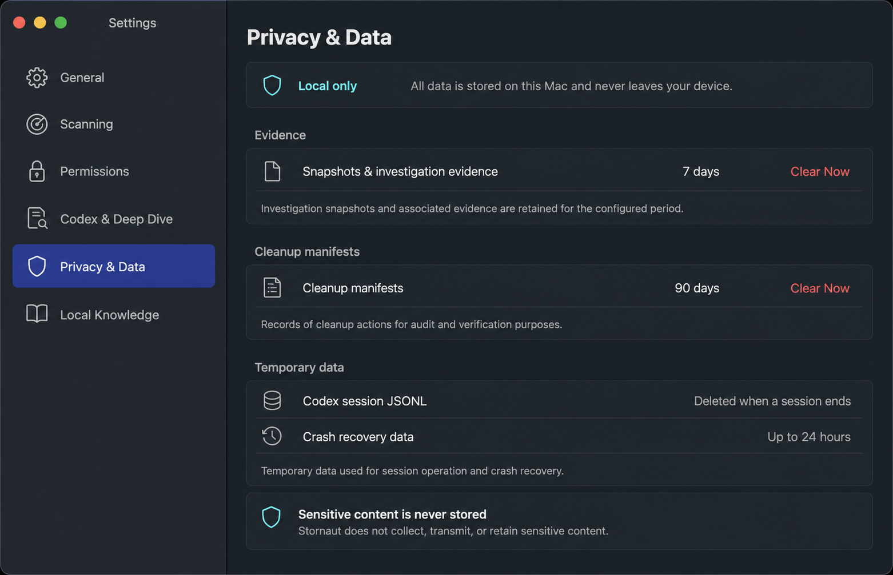

Strongest macOS information architecture and density. Fixed 7-day evidence and 90-day minimal Manifest retention read naturally as policy values rather than editable preferences. Approved as the dominant Settings shell.

### B — Toolbar Tabs / Permissions

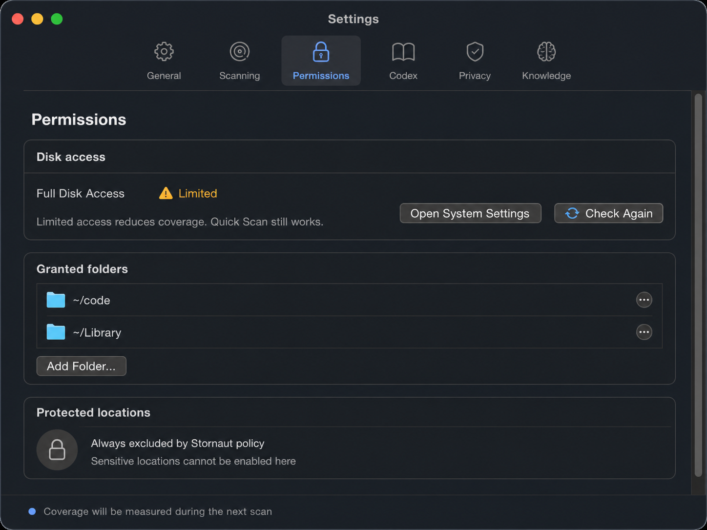

Classic macOS preference-window treatment and a useful Permissions state. Six tabs make the toolbar wide and abbreviate `Codex & Deep Dive` and `Local Knowledge`, so this is retained as a section-content reference rather than the default shell.

### C — General + Setup Status

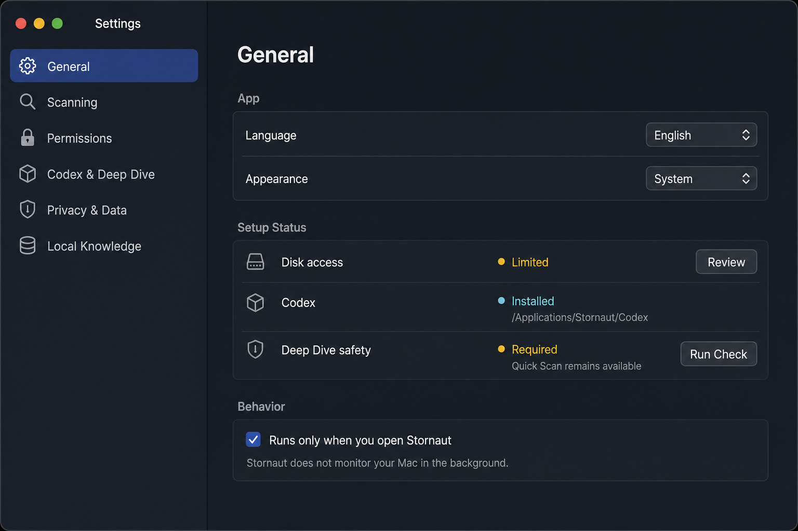

Best first-open comprehension. Language and appearance remain ordinary preferences while Disk access, Codex discovery, and Deep Dive safety appear as independent status rows with repair actions. Approved inside General after correcting the generated Codex path fixture and replacing the checkbox-like behavior row with non-interactive information.

### D — Single Scroll

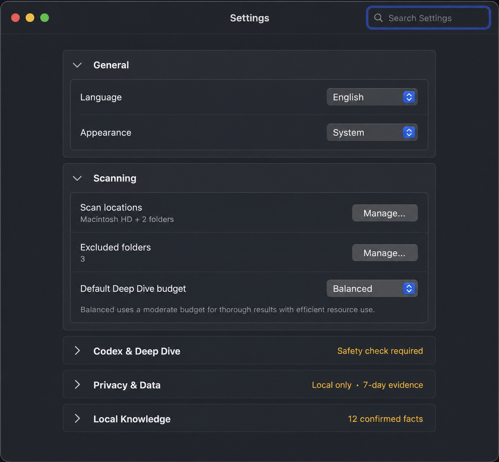

Compact and inexpensive to implement, but disclosure sections mix preferences, permissions, runtime checks, privacy, and knowledge into one long form. Search is unnecessary for six sections. Rejected as the default architecture.

### E — Local Knowledge

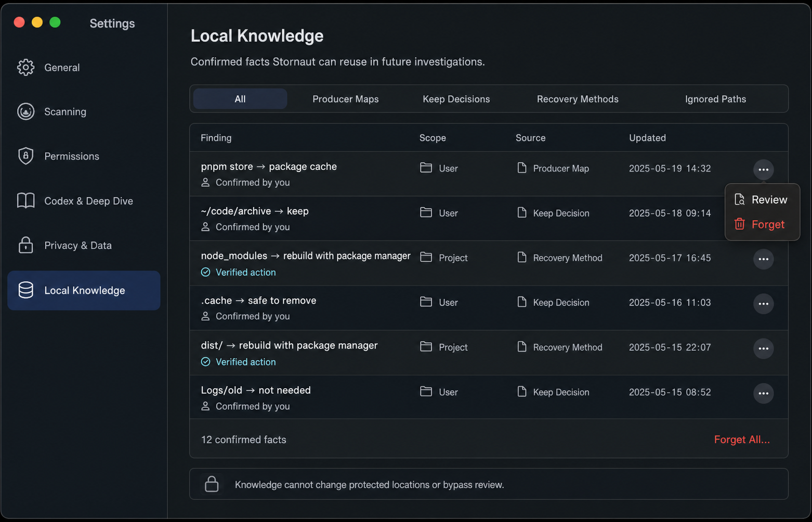

Strongest structured-memory management pattern. Filters, provenance, review, and forgetting are visible without becoming a database console. Approved after removing over-broad generated examples such as a generic cache being declared safe to remove.

## Approved Settings architecture

Use A's native Settings sidebar, C's compact Setup Status inside General, and E's structured Local Knowledge list.

| Section | Editable controls | Status / repair only | Never exposed as a bypass |
| --- | --- | --- | --- |
| General | Language; System/Light/Dark | Setup Status links | Background monitoring or automatic cleanup |
| Scanning | Scan roots/bookmarks; excluded folders; rule overlay and optional Adapter enablement where supported | Current scope summary; unavailable Adapter explanation | Permanent protected locations |
| Permissions | Granted folder bookmarks | Full Disk Access state; coverage consequence; Open System Settings; Check Again | FDA as an in-app toggle; denylist exceptions |
| Codex & Deep Dive | Default `10 min · Focused`, `30 min · Balanced`, or `60 min · Thorough`; advanced budget limits under disclosure | Codex path/version/capabilities; independent safety check | Model provider; arbitrary shell/CLI flags; isolation bypass |
| Privacy & Data | Immediate deletion actions | Local-only statement; evidence `7 days`; minimal Manifest `90 days`; JSONL lifecycle | Arbitrary retention extension; sensitive-content storage |
| Local Knowledge | Review or forget individual confirmed facts; Forget All with confirmation | Type, scope, provenance, staleness | Free-text Agent memory; direct disposition/policy override |

All preference changes apply immediately. There is no global Save button. Destructive `Clear Now`, `Forget`, and `Forget All…` actions require confirmation that names the affected local records and states that files on disk and prior cleanup effects are unchanged.

## Canonical references

### General and Setup Status

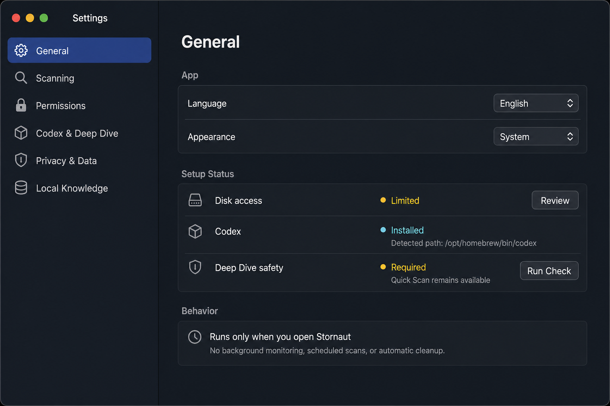

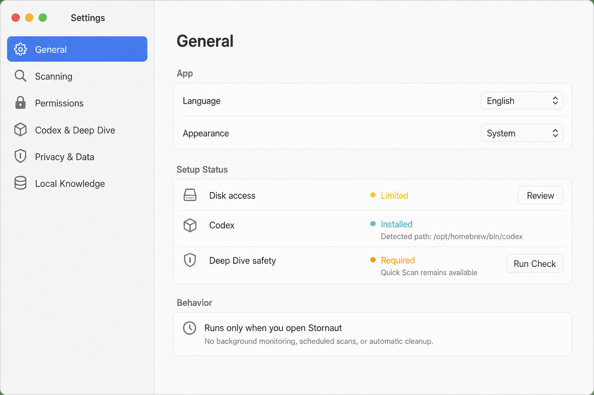

### Codex and Deep Dive

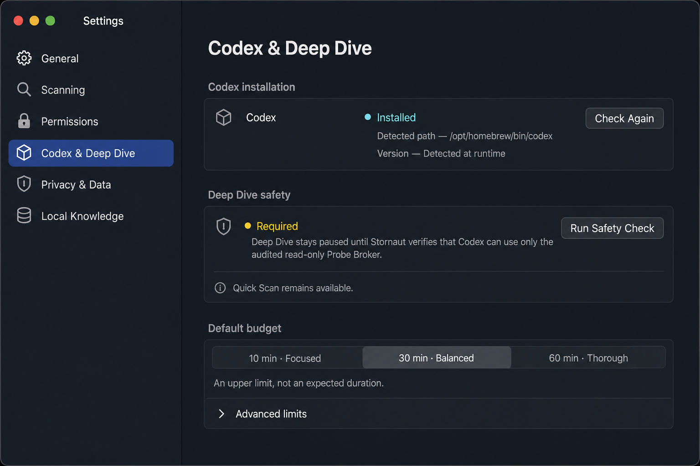

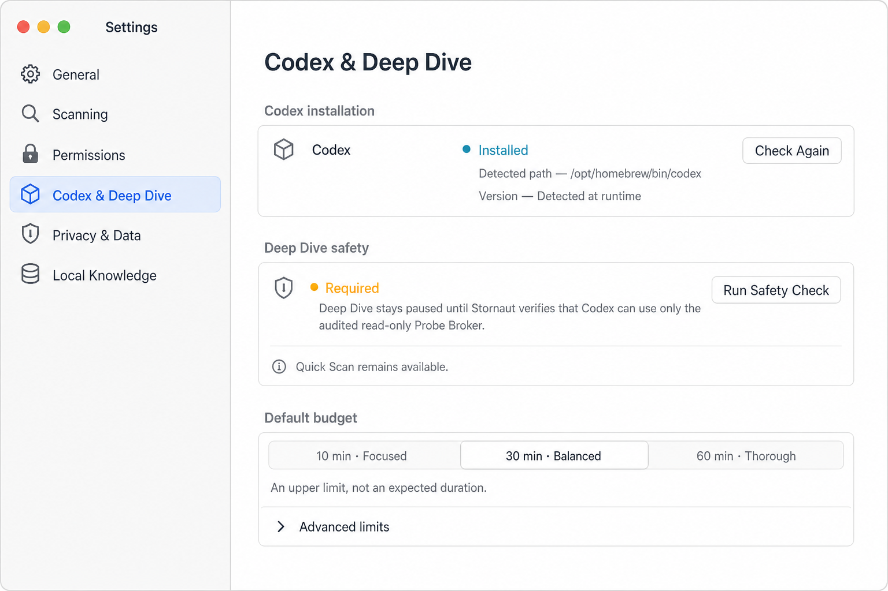

### Local Knowledge

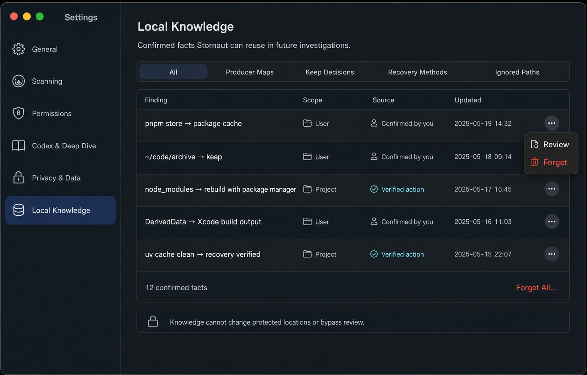

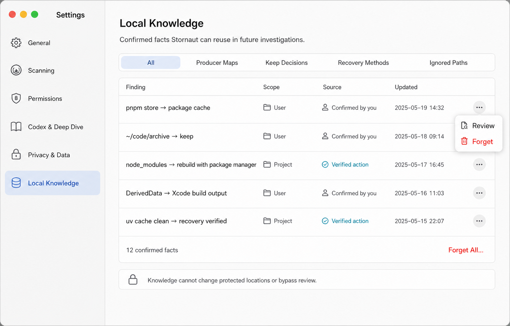

The pairs establish shell geometry, density, theme parity, state separation, and destructive-action hierarchy. Generated paths, versions, dates, counts, scopes, and example findings remain fixtures and must come from live domain state.

## Remaining section behavior

### Scanning

- Show scan roots and security-scoped folder bookmarks in a native list with Add, Remove, and Reveal actions.
- Show excluded folders separately from permanent protected locations. User exclusions are editable; protected locations are policy-owned and read-only.
- Optional rules and Adapters use availability-aware controls with provenance/version details under disclosure. Missing Adapters degrade only their related signals.
- Do not present a developer-tool checklist as if it were exhaustive. Node, Python, Rust, Go, Xcode, Android, Next.js, Homebrew, and future ecosystems remain dynamic facets and rules.

### Permissions

- FDA uses `Full`, `Limited`, or check/error status, never an in-app toggle.
- `Open System Settings` is the primary repair route; `Check Again` re-runs the local check after return.
- Always state the effect: limited access reduces measured coverage while Quick Scan remains available.
- Granted folders are editable bookmarks. Permanent protected locations show a lock and no affordance to add an exception.

### Privacy & Data

- Retention values are read-only policy rows, not steppers or menus.
- `Clear Evidence Now…` deletes eligible 7-day records. `Clear Manifests Now…` is separate because it removes the 90-day audit trail.
- Raw controlled-read content is described as memory-only. Codex JSONL is deleted at normal session end; crash remnants are cleaned within 24 hours.
- Every destructive record-deletion dialog states that it does not delete user files, alter Trash, or undo cleanup.

## Accessibility and motion

- Sidebar and detail use standard keyboard focus; changing sidebar selection moves VoiceOver focus to the detail heading.
- Status never relies on cyan, amber, or red alone; every state has an icon and explicit label.
- Controls maintain at least 44 pt interaction targets and support Dynamic Type without truncating safety explanations.
- `Run Safety Check` and `Check Again` show an inline progress indicator after 300 ms, remain cancellable where applicable, and announce completion.
- Settings uses only short native crossfades/selection transitions. No orbit, Probe motion, or decorative Agent animation appears here.

## Prompt set

All images used the `ui-mockup` or `precise-object-edit` taxonomy through `$erik-gpt-image-2`. Shared prompt constraints were: shippable SwiftUI/AppKit macOS Settings, Native Observatory, system Light/Dark parity, readable English, native grouped rows, no main-app navigation, no dashboard, no background monitoring, no scheduling, no automatic cleanup, no denylist bypass, no chat/console/terminal, no sparkle decoration, no star map, and no watermark.

- A prompt: six-item native Settings sidebar with `Privacy & Data` selected; fixed 7/90-day retention and temporary JSONL lifecycle.
- B prompt: classic six-tab toolbar with `Permissions` selected; FDA status, granted folders, and read-only protected locations.
- C prompt: sidebar with `General` selected; Language, Appearance, Setup Status, and a visible on-demand-only product boundary.
- D prompt: compact searchable single-scroll form with expanded General/Scanning and collapsed status summaries.
- E prompt: Local Knowledge filtered list with Finding/Scope/Source/Updated, provenance, Review/Forget, and protected-policy note.
- General canonical prompt: refine C into A's approved shell semantics, use `/opt/homebrew/bin/codex` only as a fixture, and make the on-demand behavior row non-interactive; then create a structure-identical light counterpart.
- Codex canonical prompt: reuse the canonical shell; separate installation from safety, show `Required`, preserve Quick Scan degradation, expose three time-budget presets and collapse advanced limits; then create a structure-identical light counterpart.
- Local Knowledge canonical prompt: reuse E while replacing unsafe generic cleanup claims with conservative producer, Keep, and verified-recovery facts; then create a structure-identical light counterpart.

## Implementation boundary

These are composition references, not a license to hard-code fixture states. Settings ViewModels consume domain state and call typed services; views do not discover Codex, inspect FDA, mutate stores, or bypass policy directly. Any future control that changes permissions, retention, safety policy, Agent authority, background behavior, or Local Knowledge semantics requires a PRD/spec update and explicit approval.
